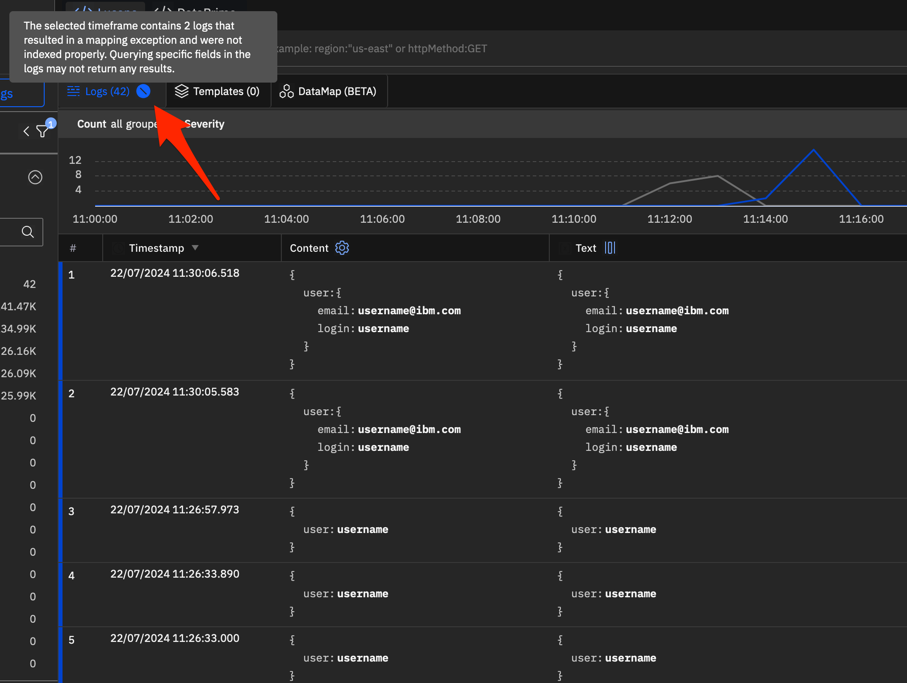
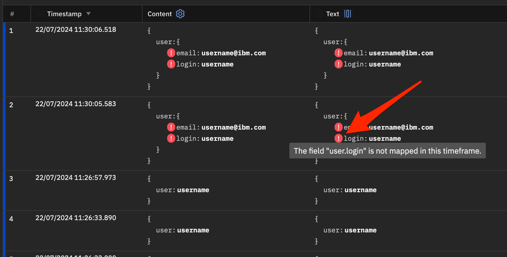
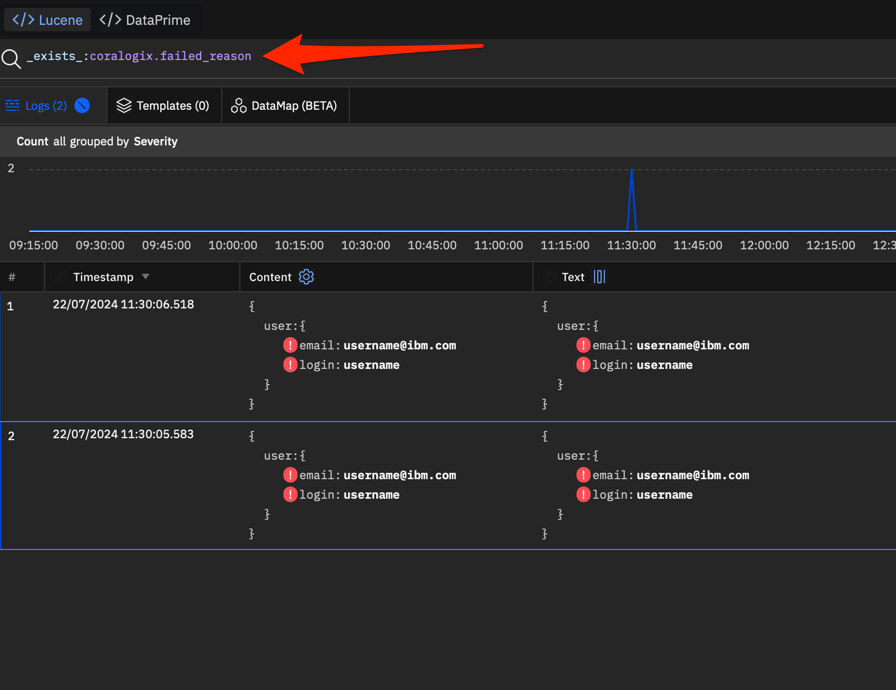

1. Check the {{site.data.keyword.logs_full_notm}} UI for an icon next to the logs count:

   {: caption="Mapping exceptions icon" caption-side="bottom"}

   Hovering over the icon will display the number of logs with mapping exceptions within the query results in the selected timeframe.

2. To identifying the specific logs that were not properly indexed, enable the `Show Mapping Exception` option:

   {: caption="Selecting how to show mapping errors" caption-side="bottom"}

   After enabling this option, refresh your browser. An exclamation mark will be displayed on the fields that have mapping exceptions and were not indexed.

   {: caption="Flagging of fields with mapping exceptions" caption-side="bottom"}

Another way to quickly identify which fields have a mapping exception is to run the query: `_exists_: coralogix.failed_reason`

{: caption="Results of a query to show mapping exceptions." caption-side="bottom"}

This query will return only the log lines that have a mapping exception for the selected timeframe.

There are two ways you can resolve mapping exceptions. One is to search without indexing. The other is to fix log records at ingestion.

* If you do not find a field when querying due to mapping exceptions, you can search in `All Logs` instead of `Priority Insights`. When searching in `All Logs`, indexing and mapping exceptions are bypassed by the search.

* You can fix new log records being ingested with the same field names but with different data types.

   1. Create a [RegEx expression](/docs/cloud-logs?topic=cloud-logs-parse-rules-regex) to replace the field name with the appropriate sufix. For example:

      `field_obj`
      :  If {{site.data.keyword.logs_full_notm}} is expecting a string, but found an object:
          * Regular Expression: `("field"\s*:\s*{)`
          * Replace with: `"field_obj":{`

      `field_arr`
      :  If {{site.data.keyword.logs_full_notm}} is expecting a string, but found an array:
         * Regular Expression: `("field"\s*:\s*[)`
         * Replace with: `"field_arr":[`

      `field_str`
      :  If {{site.data.keyword.logs_full_notm}} is expecting an object, but found a string:
         * Regular Expression: `("field"\s*:\s*")`
         * Replace with: `"field_str":"`

   2. Create a parsing [replace rule](/docs/cloud-logs?topic=cloud-logs-parse-replace-rule&interface=ui) to fix new logs using the RegEx.
