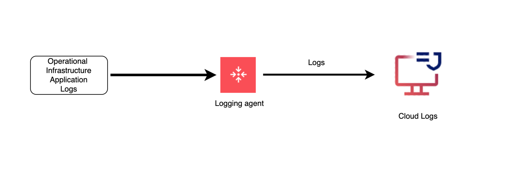
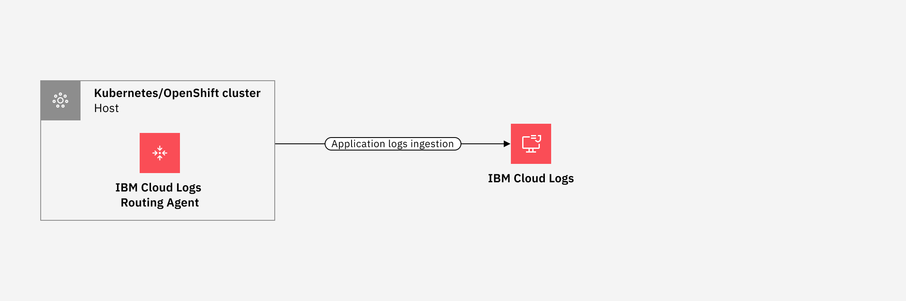

---

copyright:
  years:  2024, 2025
lastupdated: "2024-10-28"

keywords:

subcollection: cloud-logs

---

{{site.data.keyword.attribute-definition-list}}

# The {{site.data.keyword.agent}}
{: #agent-about}

You can configure the {{site.data.keyword.agent}} to collect and send infrastructure and application logs to an {{site.data.keyword.logs_full_notm}} instance directly.
{: shortdesc}

The {{site.data.keyword.agent}} is based on the Fluent Bit open-source agent which is used to collect and process log data. You can deploy the {{site.data.keyword.agent}} in supported environments and manage data from various sources and formats.

The following diagram shows the high level view when the destination is an {{site.data.keyword.logs_full_notm}} instance:

{: caption="Flow of logs from agent" caption-side="bottom"}

## About the {{site.data.keyword.agent}}
{: #agent-about-ov}

When you use the {{site.data.keyword.agent}} to send logs to the {{site.data.keyword.logs_full_notm}} service, logs that you send must include a value for the `applicationName` and `subsystemName` metadata fields. By default, when you configure the {{site.data.keyword.agent}}, the agent sets default values for these fields. You can configure your own custom values to replace the default values.
- For more information on default values, see [Metadata fields](/docs/cloud-logs?topic=cloud-logs-metadata).
- For more information on how to configure the agent, see [Configuring the agent to set custom values for applicationName and subsystemName metadata fields](/docs/cloud-logs?topic=cloud-logs-agent-set-appsubname).

The severity of a log record is identified by the {{site.data.keyword.agent}} as follows:
1. If the log is parsed by the {{site.data.keyword.agent}} and contains a field named `severity`, `level` or `logLevel`, that field is used to set the severity.
2. If the log record does not contain a field named `severity`, `level` or `logLevel`, the message field is scanned to set the level based on a text search for `debug`, `info`, `error`, or `warn`.

If the {{site.data.keyword.agent}} cannot determine the severity of a log record, it sets the severity to `info`.

## {{site.data.keyword.agent}} for orchestrated environments
{: #agent-about-orchestrated}

You can deploy the {{site.data.keyword.agent}} on a {{site.data.keyword.openshiftlong_notm}} or {{site.data.keyword.containerlong_notm}} cluster.

You can deploy the agent on clusters that you run on-prem, in {{site.data.keyword.cloud_notm}}, or in a different cloud.

The {{site.data.keyword.agent}} is a daemon set that is designed to have one pod running on each node of a cluster. Each pod will collect relevant logs for the node its running on. The {{site.data.keyword.agent}} will then forward those logs to the {{site.data.keyword.logs_full_notm}} service.

By default, the {{site.data.keyword.agent}} monitors and collects log data from files matching the specified path pattern in `/var/log/containers/`, excluding logs from files matching the exclusion pattern. The refresh interval is set to 10 seconds. You can change these values and more in the config map `logger-agent-config`. For more information, see [Filtering logs](/docs/cloud-logs?topic=cloud-logs-configure-include-exclude).

You can deploy the agent in the following platforms:
- Kubernetes clusters

    For more information, see [Deploying the {{site.data.keyword.agent}} on a Kubernetes cluster using a Helm chart](/docs/cloud-logs?topic=cloud-logs-agent-helm-kube-deploy).

- OpenShift clusters

    For more information, see [Deploying the {{site.data.keyword.agent}} on OpenShift using a Helm chart](/docs/cloud-logs?topic=cloud-logs-agent-helm-os-deploy).

The following diagram shows the high level view when the source of logs is a Kubernetes or OpenShift cluster:

{: caption="Flow of logs from cluster" caption-side="bottom"}

## {{site.data.keyword.agent}} for non-orchestarted environments
{: #agent-about-std}

You can deploy the {{site.data.keyword.agent}} in Linux and Windows environments.

You must configure the log files that the {{site.data.keyword.agent}} monitors and forwards its data to your {{site.data.keyword.logs_full_notm}} instance.

The agent runs as a Linux daemon by using `systemd`. You can manage the agent by using `systemctl`.

The following platforms are supported:

- RHEL 8
- RHEL 9
- Ubuntu 20
- Ubuntu 22
- Debian 11
- Debian 12
- Windows Server 2016
- Windows Server 2019
- Windows Server 2022
- Windows 10 Enterprise
- Windows 11 Enterprise

For more information, see [Managing the agent in Linux environments](/docs/cloud-logs?topic=cloud-logs-agent-linux) or [Managing the agent in Windows environments](/docs/cloud-logs?topic=cloud-logs-agent-windows).

## Authorization methods
{: #agent-auth-methods}

You can use a service ID or a trusted profile as the identity that is used by the agent to authenticate with the {{site.data.keyword.logs_full}} service.

Choose a supported authorization method for the environment where you plan to deploy the agent:

| Environment                                         | Service ID API key | Trusted Profile |
|-----------------------------------------------------|--------------|--------------------|
| {{site.data.keyword.cloud_notm}} Kubernetes cluster | Supported    | Supported    |
| {{site.data.keyword.cloud_notm}} OpenShift cluster  | Supported    | Supported    |
| {{site.data.keyword.cloud_notm}} Linux VSI          | Supported    | Supported    |
| {{site.data.keyword.cloud_notm}} Windows VSI        | Supported    | Supported    |
| On-prem Kubernetes cluster                          | Supported    | Not supported |
| On-prem OpenShift cluster                           | Supported    | Not supported |
| On-prem Linux server                                | Supported    | Not supported |
| Other Cloud Kubernetes clusters                     | Supported    | Not supported |
| Other Cloud OpenShift clusters                      | Supported    | Not supported |
| Other Cloud Linux servers                           | Supported    | Not supported |
{: caption="Supported authorization methods" caption-side="bottom"}

You can only use Trusted Profiles to authenticate {{site.data.keyword.cloud_notm}} resources with an {{site.data.keyword.logs_full_notm}} instance when the compute resource and the instance are located in the same account.
{: note}

To send logs from a Kubernetes cluster that is provisioned in a different {{site.data.keyword.cloud_notm}} account than the {{site.data.keyword.logs_full_notm}} instance, you can only use a service ID API key as the agent's authorization method.
{: note}

For more information on how to generate an API key, see [Generating an API Key for ingestion by using a service ID for authentication](/docs/cloud-logs?topic=cloud-logs-iam-ingestion-serviceid-api-key).

For more information on how to create the Trusted Profile, see [Generating a Trusted Profile for ingestion](/docs/cloud-logs?topic=cloud-logs-iam-ingestion-trusted-profile).

## Supported formats
{: #agent-about-formats}

The agent supports the following input formats:

* JSON
* apache
* apache2
* apache_error
* nginx
* docker (JSON with the docker-specific timestamp format)
* cri
* syslog

## Supported agent versions
{: #agent-about-versions}

The following table lists the agent versions that are supported and the version of Fluent Bit the agent is based on:

| {{site.data.keyword.agent}}                         | Based on Fluent Bit Version | Helm chart version |
|-----------------------------------------------------|-----------------------------|--------------------|
| v1.4.1                                              | [v3.1.9](https://fluentbit.io/announcements/v3.1.9/){: external} | v1.4.1   |
| v1.4.0                                              | [v3.1.9](https://fluentbit.io/announcements/v3.1.9/){: external} | v1.4.0   |
| v1.3.2                                              | [v3.1.9](https://fluentbit.io/announcements/v3.1.9/){: external} | v1.3.2   |
{: caption="Supported agent versions" caption-side="bottom"}

For information on recommended and supported Fluent Bit plug-ins see [Fluent Bit support](/docs/cloud-logs?topic=cloud-logs-agent-plugin-support)
{: tip}

## Agent support policy
{: #agent-support-policy}

Release agent updates are planned on a quarterly basis. Support will continue to provide assistance for two releases prior to the latest release.

For example, if agent version `1.3.x` is the most currently release, then questions related to agents `1.2.x` and `1.1.x` will be answered.

However, new functions and security fixes will only be made available as the most current release and modification level.

For example, if a security vulnerability is found in the agent, and the current agent version is `1.3.3`, the security vulnerability will be fixed and released as `1.3.4`. Even though `1.2.x` and `1.1.x` are still supported for technical questions, patches to these releases will not be made available.
