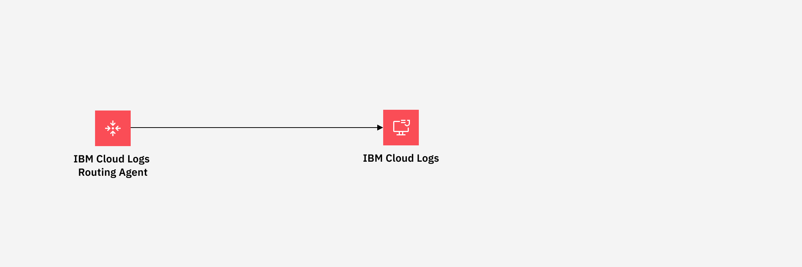

---

copyright:
  years:  2023, 2024
lastupdated: "2024-08-29"

keywords:

subcollection: logs-router

---

{{site.data.keyword.attribute-definition-list}}

# About the {{site.data.keyword.logs_routing_full_notm}} agent
{: #agent-about}

The {{site.data.keyword.agent}} is based on the Fluent Bit open-source agent which is used to collect and process log data. You can deploy the {{site.data.keyword.agent}} in supported environments and manage data from various sources and formats.
{: shortdesc}

You can configure the {{site.data.keyword.agent}} to collect and send infrastructure and application logs to an {{site.data.keyword.logs_full_notm}} instance directly.

The following diagram shows the high level view when the destination is an {{site.data.keyword.logs_full_notm}} instance:

{: caption="Figure 1. Flow of logs from agent" caption-side="bottom"}

## {{site.data.keyword.logs_routing_full_notm}} agent for orchestrated environments
{: #agent-about-orchestrated}

You can deploy the {{site.data.keyword.logs_routing_full_notm}} agent on a {{site.data.keyword.openshiftlong_notm}} or {{site.data.keyword.containerlong_notm}} cluster.

You can deploy the agent on clusters that you run on-prem, in {{site.data.keyword.cloud_notm}}, or in a different cloud.

The {{site.data.keyword.logs_routing_full_notm}} agent is a daemon set that is designed to have one pod running on each node of a cluster. Each pod will collect relevant logs for the node its running on. The {{site.data.keyword.logs_routing_full_notm}} agent will then forward those logs to the {{site.data.keyword.logs_routing_full_notm}} service.

By default, the {{site.data.keyword.logs_routing_full_notm}} agent monitors and collects log data from files matching the specified path pattern in `/var/log/containers/`, excluding logs from files matching the exclusion pattern. The refresh interval is set to 10 seconds. You can change these values and more in the config map `logger-agent-config`.

You can deploy the agent in the following platforms:
- Kubernetes clusters
- OpenShift clusters

The following diagram shows the high level view when the source of logs is a Kubernetes or OpenShift cluster:

{: caption="Figure 3. Flow of logs from cluster" caption-side="bottom"}

## {{site.data.keyword.logs_routing_full_notm}} agent for non-orchestarted environments
{: #agent-about-std}

You can deploy the {{site.data.keyword.logs_routing_full_notm}} agent in Linux environments.

The following platforms are supported:

- RHEL 8
- RHEL 9
- Ubuntu 20
- Ubuntu 22
- Debian 11
- Debian 12

## Supported formats
{: #agent-about-formats}

The agent supports the following input formats:

* JSON
* apache
* apache2
* apache_error
* nginx
* docker (JSON with the docker-specific timestamp format)
* cri
* syslog

## Supported agent versions
{: #agent-about-versions}

The following table lists the agent versions that are supported and the version of Fluent Bit the agent is based on:

| {{site.data.keyword.logs_routing_full_notm}} agent  | Based on Fluent Bit Version |
|-----------------------------------------------------|---------|
| v1.2.4                                              | [v3.1.4](https://fluentbit.io/announcements/v3.1.4/){: external} |
| v1.2.3                                              | [v3.0.4](https://fluentbit.io/announcements/v3.0.4/){: external} |
{: caption="Supported agent versions" caption-side="bottom"}

For information on recommended and supported Fluent Bit plug-ins see [Fluent Bit support](/docs/logs-router?topic=logs-router-fluentbit-support)
{: tip}

## Agent support policy
{: #agent-support-policy}

{{site.data.keyword.logs_routing_full_notm}} will release agent updates on a quarterly basis and will continue to provide assistance for two releases prior to the latest release.

For example, if agent version `1.3.x` is the most currently release, then questions related to agents `1.2.x` and `1.1.x` will be answered.

However, new functions and security fixes will only be made available as the most current release and modification level.

For example, if a security vulnerability is found in the agent, and the current agent version is `1.3.3`, the security vulnerability will be fixed and released as `1.3.4`. Even though `1.2.x` and `1.1.x` are still supported for technical questions, patches to these releases will not be made available.
