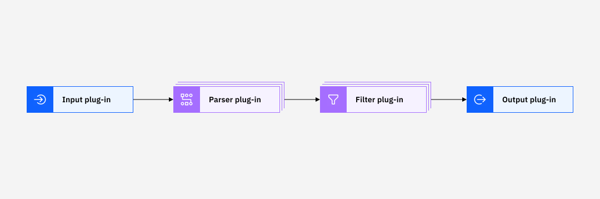

---

copyright:
  years:  2024, 2025
lastupdated: "2025-09-03"

keywords:

subcollection: cloud-logs

---

{{site.data.keyword.attribute-definition-list}}


# Understanding the agent configuration file
{: #agent-fluentbit}

The {{site.data.keyword.agent}} uses a Fluent Bit-based configuration file to determine how incoming data is processed before being routed.
{: shortdesc}

When you configure the agent's configuration file, consider the following information:
- The schema is divided into multiple sections.
- You can use Fluent Bit commands to simplify the configuration file and make it more readable.
- You can expose configuration variables by setting shell environment variables, or by using the @SET command.


## Sections
{: #agent-fluentbit-1}

The schema for a Fluent Bit configuration is divided into multiple sections.

- A section is defined by a name inside brackets.
- There are four types of sections that you can configure: `Service`, `Input`, `Filter`, and `Output`.
- A section can contain 1 or more entries.
- An entry is defined by a line of text that contains a key and a value. The key must be indented and must contain a value which ends in the breakline. Consider using an indentation of four spaces.

The following diagram shows the order in which sections are applied:

{: caption="Fluent Bit processing order of sections" caption-side="bottom"}


### SERVICE section
{: #agent-fluentbit-2}

You can configure the `SERVICE` section to define global properties of the service.

The following table lists some keys that you can define in a `SERVICE` section:

| Key | Description	| Default Value |
|-----|-------------|---------------|
| `flush` | Set the time in seconds.nanoseconds to flush the records that are ingested by input plug-ins through the output plug-ins. | `5` |
| `log_file` | The absolute path for other log files. | By default, logs are redirected to the standard error interface (stderr). |
| `log_level` | Set the logging verbosity level. Valid values are: `off`, `error`, `warn`, `info`, `debug` and `trace`. Notice that values are accumulative. For example, if `debug` is set, it will include `error`, `warning`, `info` and `debug`. | `info` |
| `parsers_file` | Path for the configuration file of a parser. Multiple `Parsers_File` entries can be defined within a section. | |
{: caption="Service kyes" caption-side="bottom"}

For more information on additonal keys that are supported, see [Service section properties](https://docs.fluentbit.io/manual/administration/configuring-fluent-bit/classic-mode/configuration-file#config_section){: external}.


For example, a sample SERVICE section can be the following:

```yaml
[SERVICE]
      Flush                   1
      Log_Level               info
      Daemon                  off
      Parsers_File            parsers.conf
      plug-ins_File           plug-ins.conf
      HTTP_Server             On
      HTTP_Listen             0.0.0.0
      HTTP_Port               8081
      Health_Check            On
      HC_Errors_Count         1
      HC_Retry_Failure_Count  1
      HC_Period               30
      storage.path            /fluent-bit/cache
      storage.max_chunks_up   192
      storage.metrics         On
```
{: codeblock}


### INPUT section
{: #agent-fluentbit-3}

You can configure `INPUT` sections to define the sources from where Fluent Bit can collect data.


The following table outlines keys that you can configure for an `INPUT` section:

| Key | Description | Status |
|-----|-------------|--------|
| `Name` | Name of the input plug-in. Determines which input plug-in should be loaded by Fluent Bit. | Required |
| `Tag` | Tag that is associated to all records coming from this plug-in. | Required for all plug-ins except for the input forward plug-in which provides dynamic tags. |
| `Log_Level` | Set the logging verbosity level. Valid values are: `off`, `error`, `warn`, `info`, `debug` and `trace`. Notice that values are accumulative. For example, if `debug` is set, it will include `error`, `warning`, `info` and `debug`. If not set, the value defaults to the `SERVICE` section's `Log_Level` value. | Optional |
| `Path` | Set the location where logs records are read.  \n  \n For Kubernetes logs, by default the {{site.data.keyword.logs_full_notm}} {{site.data.keyword.agent}} collects logs only from the `/var/log/containers/*.log` directory. If you want to collect logs from all subdirectories under `/var/log`, your need to add `/var/log/**/*.log` to the `Path` parameter. | Optional |
{: caption="Input keys" caption-side="bottom"}

For more information about the `INPUT` plug-ins, see [Input plug-ins](https://docs.fluentbit.io/manual/data-pipeline/inputs){: external}.

Each `INPUT` plug-in has its own configuration keys in addition to the ones outlined in the table.
{: note}

For example, a sample `INPUT` section could be the following:

```yaml
[INPUT]
    # Comment
    Name tail
    Tag  kube.*
    log_level info
```
{: codeblock}


### FILTER section
{: #agent-fluentbit-4}

You can configure `FILTER` sections to transform the data that is related to a `FILTER` plug-in before sending it to your destination.

The following table outlines keys that you can configure for a `FILTER` section:

| Key | Description | Status |
|-----|-------------|--------|
| `Name` | Name of the filter plug-in. Determines which filter plug-in should be loaded by Fluent Bit. | Required |
| `Match` | A pattern that is used to match against the tags that are defined on incoming records. `Match` is case-sensitive. You can use the asterisk character `*` as a wildcard. |  Required `[*]` |
| `Match_Regex` | A regular expression that is used to match against the tags that are defined on incoming records. Use this option to use the full regex syntax. |  Required  `[*]`|
| `Log_Level` | Set the logging verbosity level. Valid values are: `off`, `error`, `warn`, `info`, `debug` and `trace`. Notice that values are accumulative. For example, if `debug` is set, it will include `error`, `warning`, `info` and `debug`. If not set, the value defaults to the `SERVICE` section's `Log_Level` value. | Optional |
{: caption="Filter keys" caption-side="bottom"}


`[*]` You can configure the `Match` key, the `Match_Regex` key or both. You must always configure one. If you configure both, `Match_Regex` takes precedence.
{: note}

For example, a sample FILTER section can be the following:

```yaml
[FILTER]
    Name  kubernetes
    Match kube.*
    log_level info
```
{: codeblock}


### OUTPUT section
{: #agent-fluentbit-5}

You can configure `OUTPUT` sections to define the destinations where Fluent Bit should send the data after a Tag match.

Fluent Bit can route up to 256 `OUTPUT` plug-ins.
{: note}

The following table outlines keys that you can configure for an OUTPUT section:

| Key | Description | Status |
|-----|-------------|--------|
| `Name` | Name of the output plug-in. Determines which output plug-in should be loaded by Fluent Bit. | Required |
| `Match` | A pattern that is used to match against the tags that are defined on the incoming records. `Match` is case-sensitive. You can use the asterisk character `*` as a wildcard. |  Required `[*]` |
| `Match_Regex` | A regular expression that is used to match against the tags that are defined on incoming records. Use this option to use the full regex syntax. |  Required  `[*]`|
| `Log_Level` | Set the logging verbosity level. Valid values are: `off`, `error`, `warn`, `info`, `debug` and `trace`. Notice that values are accumulative. For example, if `debug` is set, it will include `error`, `warning`, `info` and `debug`. If not set, the value defaults to the `SERVICE` section's `Log_Level` value. | Optional |
{: caption="Output keys" caption-side="bottom"}


`[*]` You can configure the `Match` key, the `Match_Regex` key or both. You must always configure one. If you configure both, `Match_Regex` takes precedence.
{: note}


For example, the OUTPUT section of the `logger-icl-output-plugin` is similar to the  follows:

```yaml
    [OUTPUT]
        Name logger-icl-output-plugin
        Id icl-output-plugin
        Match *
        Retry_Limit 8

        # Connection
        Target_Host REPLACE_INGESTER_HOST
        Target_Port REPLACE_INGESTER_PORT
        Target_Path /logs/v1/singles

        # Authentication
        Authentication_Mode REPLACE_IAM_AUTH_MODE
        IAM_Environment REPLACE_IAM_ENVIRONMENT
        REPLACE_TRUSTED_PROFILE_ID
        CR_Token_Mount_Path /var/run/secrets/tokens/vault-token

        # Logging
        Logging_Level info

        # Buffer storage
        storage.total_limit_size 5G
```
{: codeblock}


The `logger-icl-output-plugin` uses Fluent Bit built in health check. The pod is considered unhealthy when the plug-in throws at least one error or when retry limits are exhausted in a period of 30 seconds.


## Variables
{: #agent-fluentbit-6}

In Fluent Bit, you can use environment variables to set the value of a key that is defined in the Fluent Bit configuration file.

Variables are case-sensitive.
{: note}

Use the following format to represent variables:

```yaml
${MY_VARIABLE}
```
{: codeblock}

To define an environment variable, you can use the bash syntax.

To define environment variables, you can choose any of the following options:

- Open a terminal and set environment variables by using the export command.

    For example, you can define one as follows: `$ export MY_VARIABLE=stdout`.

    When Fluent Bit starts, the configuration reader will look for an environment variable with name `MY_VARIABLE`.

- When Fluent Bit runs under systemd by using the official packages, set environment variables in any of the following files: `/etc/default/fluent-bit` (Debian-based system) or `/etc/sysconfig/fluent-bit` (Other systems).

For example, open a terminal and set the environment variable: `$ export MY_OUTPUT=stderr` Then, create the following configuration file:

```yaml
[INPUT]
    Name              tail
    Tag               kube.*

[OUTPUT]
    Name  ${MY_OUTPUT}
    Match kube.*
```
{: screen}

The key Name that is defined to be set with the environment variable `${MY_OUTPUT}` is set to stderr.

## Commands
{: #agent-fluentbit-7}

You can use Fluent Bit commands to simplify the configuration file and make it more readable.

The following table outlines the commands that you can use:


| Command |	Description | Example |
|---------|-------------|--------|
| `@INCLUDE` | Include a configuration file. | `@INCLUDE <FILE>` |
| `@SET` | Set a configuration variable. | `@SET KEY=VAL` |
{: caption="Supported commands" caption-side="bottom"}


### `INCLUDE` command
{: #agent-fluentbit-8}

To avoid complicated long configuration files, you can split the main Fluent Bit configuration file into multiple files by using the `@INCLUDE` command. The `@INCLUDE` command lets you include external files.
{: note}

You can include additional configuration files by adding entries that comply with the following format:

```yaml
@INCLUDE <FILE>
```
{: codeblock}


Consider the following information when using the `@INCLUDE` command:
- You can use the `@INCLUDE` command at the top-left level of the configuration line.
- You cannot include the `@INCLUDE` command inside a section.
- You can use the wildcard character (`*`) to include multiple files. For example, you can use: `@INCLUDE input_*.conf`.
- When you include multiple files by using the wildcard (`*`), files that match the wildcard character are included unsorted. If you need to preserve order between files, the files must be explicitly included in the desired order.
- All paths that you define are read as relative from the root configuration file.

For example,

```yaml
@INCLUDE somefile.conf
```
{: codeblock}

### `SET` command
{: #agent-fluentbit-9}

You can use the `@SET` command to inject configuration variables into the Fluent Bit configuration.
{: note}

- You can use the `@SET` command at root level of each line.
- You cannot use the `@SET` command inside a section.

For example, you can set the following variables and use them to configure different keys:

```yaml
@SET my_input=abc
@SET my_output=def

[SERVICE]
    Flush 1

[INPUT]
    Name ${my_input}

[OUTPUT]
    Name ${my_output}
```
{: codeblock}
