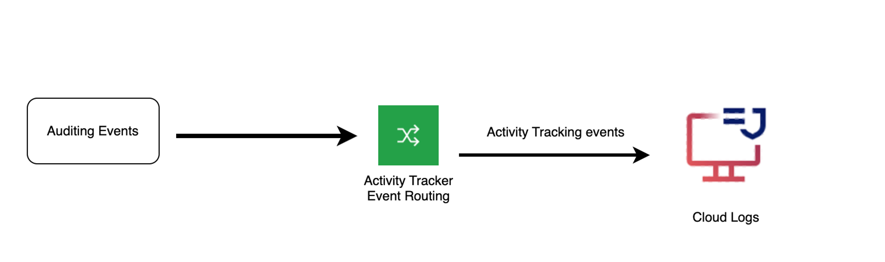

---

copyright:
  years:  2024
lastupdated: "2024-10-09"

keywords:

subcollection: cloud-logs

---

{{site.data.keyword.attribute-definition-list}}

# Monitoring activity tracking events in {{site.data.keyword.logs_full_notm}}
{: #cl-at-events}

You can use the {{site.data.keyword.logs_full_notm}} service to monitor and alert on activity tracking events that are generated in an {{site.data.keyword.cloud_notm}} account.
{: shortdesc}

The following diagram shows the high level view when the destination is an {{site.data.keyword.logs_full_notm}} instance:

{: caption="Flow of events" caption-side="bottom"}

Activity tracking events are critical data for security operations and a key element for meeting compliance requirements.

In {{site.data.keyword.logs_full_notm}}, activity tracking events that are generated by {{site.data.keyword.cloud_notm}} services include metadata fields that you can use to enhance searches and analyze the data.
- `applicationName`: The application name is the environment that produces and sends logs to {{site.data.keyword.logs_full_notm}}. It is set to `ibm-audit-events` for activity tracking events.
- `subsystemName`: The subsystem name is the service or application that produces and sends logs to {{site.data.keyword.logs_full_notm}}. It is set as follows for activity tracking events:

    For {{site.data.keyword.cloud_notm}} services that you can provision, the format is: `crn-service-name:<INSTANCE_GUID>

    For VPV services, the format is: `is:<VPC_SERVICE_NAME>

    For platform services (this are services that you cannot provision), the format is: `crn-service-name:`

Before you can monitor activity tracking events that are generated in an {{site.data.keyword.cloud_notm}} account, you must configure the {{site.data.keyword.atracker_full_notm}} service in the account to define what activity tracking events you want to collect, the destination where you want to monitor the events, and the routing rules that define where the events are routed.

- You can configure 1 or more {{site.data.keyword.logs_full_notm}} instances in the account.
- The {{site.data.keyword.logs_full_notm}} instances can be located in the same account where events are generated or in a different account.
- You must define a service to service authorization between {{site.data.keyword.atracker_full_notm}} and {{site.data.keyword.logs_full_notm}} to grant permissions to the {{site.data.keyword.atracker_full_notm}} service to send events to the {{site.data.keyword.logs_full_notm}} service.

For more information, see:
- [Getting started with {{site.data.keyword.atracker_full_notm}}](/docs/atracker?topic=atracker-getting-started)
- [{{site.data.keyword.cloud_notm}} services that generate events that are managed through {{site.data.keyword.atracker_full_notm}}](/docs/atracker?topic=atracker-cloud_services_atracker)

## Central model
{: #cl-at-events-central}

Configure {{site.data.keyword.atracker_full_notm}} in your account to route activity tracking events to 1 {{site.data.keyword.logs_full_notm}} instance if you have a requirement to centralize activity tracking events.
{: note}

The following image shows a high-level view of the account when you adopt a central model:

{: caption="High-level view of the account when you adopt a central model}}" caption-side="bottom"}

## Data locality model
{: #cl-at-events-data-locality}

Configure {{site.data.keyword.atracker_full_notm}} in your account to route activity tracking events to multiple {{site.data.keyword.logs_full_notm}} instances if you have a requirement to maintain data locality.
{: note}

The following image shows a high-level view of the account when you adopt a data locality model:

{: caption="High-level view of the account when you adopt a data locality model" caption-side="bottom"}
