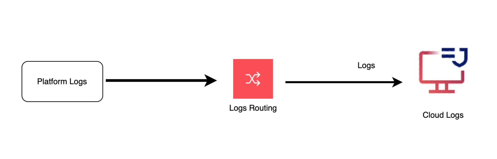

---

copyright:
  years:  2024
lastupdated: "2024-10-09"

keywords:

subcollection: cloud-logs

---

{{site.data.keyword.attribute-definition-list}}

# Monitoring platform logs in {{site.data.keyword.logs_full_notm}}
{: #cl-at-platform-logs}

You can use the {{site.data.keyword.logs_full_notm}} service to monitor and alert on platform logs that are generated in an {{site.data.keyword.cloud_notm}} account.
{: shortdesc}

The following diagram shows the high level view when the destination is an {{site.data.keyword.logs_full_notm}} instance:

{: caption="Flow of logs" caption-side="bottom"}

Before you can monitor platform logs that are generated in an {{site.data.keyword.cloud_notm}} account, you must configure the {{site.data.keyword.logs_routing_full_notm}} service in the account to define what platform logs you want to collect, the destination where you want to monitor the platform logs, and the routing rules that define where the platform logs are routed.

- You can configure 1 or more {{site.data.keyword.logs_full_notm}} instances in the account.
- The {{site.data.keyword.logs_full_notm}} instances must be located in the same account where platform logs are generated.
- You must define a service to service authorization between {{site.data.keyword.logs_routing_full_notm}} and {{site.data.keyword.logs_full_notm}} to grant permissions to the {{site.data.keyword.logs_routing_full_notm}} service to send platform logs to the {{site.data.keyword.logs_full_notm}} service.

For more information, see:
- [Getting started with {{site.data.keyword.logs_routing_full_notm}}](/docs/logs-router?topic=logs-router-getting-started)
- [{{site.data.keyword.cloud_notm}} services that generate platform logs](/docs/logs-router?topic=logs-router-cloud_services)

## Central model
{: #cl-at-platform-logs-central}

Configure {{site.data.keyword.logs_routing_full_notm}} in your account to route platform logs to 1 {{site.data.keyword.logs_full_notm}} instance if you have a requirement to centralize platform logs.
{: note}

The following image shows a high-level view of the account when you adopt a central model:

{: caption="High-level view of the account when you adopt a central model}}" caption-side="bottom"}

## Data locality model
{: #cl-at-platform-logs-data-locality}

Configure {{site.data.keyword.logs_routing_full_notm}} in your account to route platform logs to multiple {{site.data.keyword.logs_full_notm}} instances if you have a requirement to maintain data locality.
{: note}

The following image shows a high-level view of the account when you adopt a data locality model:

{: caption="High-level view of the account when you adopt a data locality model" caption-side="bottom"}
