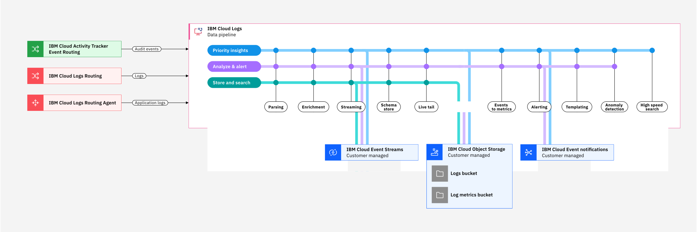

---

copyright:
  years:  2024, 2025
lastupdated: "2025-04-21"

keywords:

subcollection: cloud-logs

---

{{site.data.keyword.attribute-definition-list}}

# Controlling data ingested for search in {{site.data.keyword.logs_full_notm}}
{: #control-data}

You can control data that is ingested, and is available for search in {{site.data.keyword.logs_full_notm}}. Data can be dropped during ingestion by using TCO policies or by using parsing rules.
{: shortdesc}

{: caption="Flow of logs through {{site.data.keyword.logs_full_notm}}" caption-side="bottom"}

## TCO policy to drop logs
{: #cd-tco}

You can configure TCO policies:

- [{{site.data.keyword.frequent-search}}](/docs/cloud-logs?topic=cloud-logs-tco-data-pipelines#tco-optimizer-high)

- [{{site.data.keyword.monitoring}}](/docs/cloud-logs?topic=cloud-logs-tco-data-pipelines#tco-optimizer-medium)

- [{{site.data.keyword.compliance}}](/docs/cloud-logs?topic=cloud-logs-tco-data-pipelines#tco-optimizer-low)

to manage logs through different data pipelines based on

- [Application name](/docs/cloud-logs?topic=cloud-logs-metadata#md-app-name)
- [Subsystem name](/docs/cloud-logs?topic=cloud-logs-metadata#md-sys-name)
- Severity - `critical`, `error`, `warning`, `info`, `debug`, and `verbose`

You can also define a TCO policy to drop logs based on application name, subsystem name, and severity. The TCO policy is applied when data is received by the ingestion endpoint and before any other {{site.data.keyword.logs_full_notm}} processing.

## Using parsing rules
{: #cd-parsing}

After TCO policies are applied, you can drop or remove data within ingested logs by using [parsing rules](/docs/cloud-logs?topic=cloud-logs-log_parsing_rules).

### Block parsing rule
{: #cd-block}

You can drop ingested logs that weren't dropped by TCO policies by using the `block` parsing rule. The `block` rule drops logs based on a [RegEx expression](/docs/cloud-logs?topic=cloud-logs-parse-rules-regex).

If you configure a rule group, any application name, subsystem name, and severity filtering are applied before the `block` rule is applied.

When you define a `block` rule, you can select **View blocked logs in LiveTail and archive to IBM Cloud Object Storage**. Your dropped logs are saved in the {{site.data.keyword.compliance}} pipeline. You can search the logs from archived data. In this way, ingested log data is not lost.

Using the `block` rule is a way to move logs to low priority in a more refined way than using TCO policies. For performance reasons, specify `block` rules in a rules group before any other parsing rules.
{: tip}

### Remove parsing rule
{: #cd-remove}

You can drop parts of ingested logs that you don't need by using the `remove` parsing rule.

By removing log data that you do not need, you can control {{site.data.keyword.logs_full_notm}} costs.
