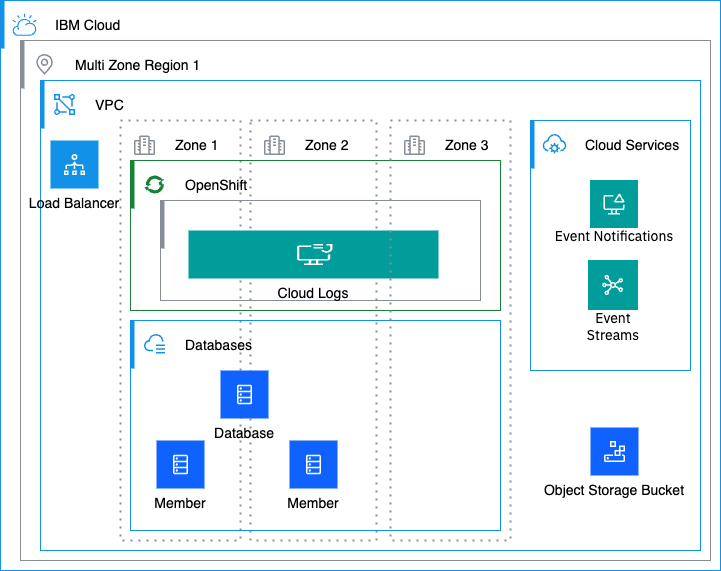
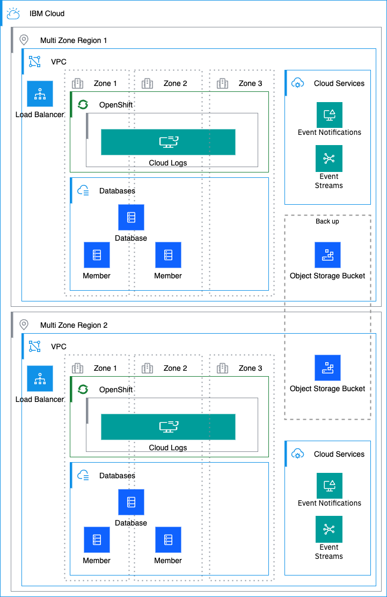

---

copyright:
  years: 2025
lastupdated: "2025-07-24"

keywords: HA for IBM Cloud Logs, DR for IBM Cloud Logs, IBM Cloud Logs recovery time objective, IBM Cloud Logs recovery point objective

subcollection: cloud-logs

---

{{site.data.keyword.attribute-definition-list}}

# Understanding high availability and disaster recovery for {{site.data.keyword.logs_full_notm}}
{: #cloud-logs-ha-dr}

[High availability](#x2284708){: term} (HA) is the ability for a service to remain operational and accessible in the presence of unexpected failures. [Disaster recovery](#x2113280){: term} is the process of recovering the service instance to a working state.
{: shortdesc}

{{site.data.keyword.logs_full_notm}} is a highly available, multi-tenant, regional service and you can find the available region and data center locations in the [Locations](/docs/cloud-logs?topic=cloud-logs-regions) documentation. As a regional service, {{site.data.keyword.logs_full_notm}} fulfills the defined [Service Level Objectives (SLO)](/docs/resiliency?topic=resiliency-slo) with the Standard plan. The SLO is not a warranty and IBM will not issue credits for failure to meet an objective.

Service level objectives (SLOs) describe the design points that the {{site.data.keyword.cloud_notm}} services are engineered to meet. {{site.data.keyword.logs_full_notm}} is designed to achieve the following availability target.

| Availability target | Target Value   |
|---|---|
|  Availability % | 99.99%  |
{: caption="SLO for {{site.data.keyword.logs_full_notm}}" caption-side="bottom"}

## High availability architecture
{: #ha-architecture}

{: caption="High availability architecture" caption-side="bottom"}

An availability zone is a logically and physically isolated location within an {{site.data.keyword.cloud_notm}} region where your data is processed and hosted.

* An availability zone has independent power, cooling, and network infrastructures that are isolated from other zones to strengthen fault tolerance by avoiding single points of failure between zones.
* An availability zone offers high bandwidth and low inter-zone latency within a region.

A region (location) is a geographically and physically separate group of one or more availability zones with independent electrical and network infrastructures isolated from other regions.

* Regions are designed to remove shared single points of failure with other regions and guarantee low inter-zone latency within the region.
* Each region has 3 different data centers (DC) for redundancy.

### High availability features
{: #ha-features}

{{site.data.keyword.logs_full_notm}} supports the following high availability features:

| Feature | Description | 
| -------------- | -------------- | 
| Multi-zone region deployment | {{site.data.keyword.logs_full_notm}} is deployed only into multi-zone regions (MZRs), and within an MZR, the data plane cluster spans all three zones, ensuring that the loss of a zone does not impact service availability. | 
| {{site.data.keyword.logs_full_notm}} resources replication across zones | All {{site.data.keyword.logs_full_notm}} resources, such as alerts, metrics & logs, are replicated across three zones within MZRs. This ensures that the data will be retained in the event of a zone loss. |
| Liveness / readiness monitoring | All microservices are monitored via Kubernetes liveness and readiness probes. | 
{: caption="HA features for {{site.data.keyword.logs_full_notm}}" caption-side="bottom"}

## Disaster recovery architecture
{: #disaster-recovery-intro}

{: caption="Disaster recovery architecture" caption-side="bottom"}

{{site.data.keyword.logs_full_notm}} is built on {{site.data.keyword.openshiftlong_notm}} on VPC that uses Multi Zone Regions and spreads all worker nodes over three zones. VPC Load Balancers process the incoming traffic and forward them to the service mesh running in the cluster.

There is no automatic cross-regional failover or cross-regional disaster recovery. If all of the availability zones in a region fail, {{site.data.keyword.logs_full_notm}} becomes unavailable in that region.

### Disaster recovery features
{: #dr-features}

{{site.data.keyword.logs_full_notm}} supports the following disaster recovery features:

| Feature | Description | 
| -------------- | -------------- | 
| Alternate region | Service running on an alternate region can be used, separate from the main service | 
| Database backup | A copy of the current dataset is stored | 
{: caption="DR features for {{site.data.keyword.logs_full_notm}}" caption-side="bottom"}

### Planning for DR
{: #features-for-disaster-recovery}

The DR steps must be practiced regularly. As you build your plan, consider the following failure scenarios and resolutions.

| Failure | Resolution |
| -------------- | -------------- |
| Hardware failure (single point) | IBM provides a database that is resilient from single point of hardware failure within a zone - no configuration is required. |
| Zone failure | {{site.data.keyword.logs_full_notm}} uses multi-zone region deployment that is resilient from a point of zone failure. |
| Data corruption | In case of data corruption, the database will be rolled back to the last stable state available in the backup site. We use {{site.data.keyword.cos_full_notm}} backups for the recovery, see [Backups](/docs/cloud-databases?topic=cloud-databases-ha-dr#backups-ha) |
| Regional failure | Follow the steps under [Your responsibilities for HA and DR](#feature-responsibilities) |
{: caption="DR scenarios for {{site.data.keyword.logs_full_notm}}" caption-side="bottom"}

## Your responsibilities for HA and DR
{: #feature-responsibilities}

{{site.data.keyword.cloud_notm}} has [business continuity](#x3026801){: term} plans in place to provide for the recovery of services within hours if a disaster occurs. You are responsible for your data backup and associated recovery of your content.

In a major regional disaster, such as an earthquake, flood, or tornado, an entire region might be impacted.

To recover an {{site.data.keyword.logs_full_notm}} instance, you must provision a new {{site.data.keyword.logs_full_notm}} instance and recreate {{site.data.keyword.logs_full_notm}} resources. You must also have a DR strategy for the {{site.data.keyword.cos_full_notm}} buckets that are associated with the instance, and the {{site.data.keyword.en_full_notm}} instance that you might have configured to trigger notification alerts.

To ensure that your workloads are resilient to such events, complete the following steps:

1. Define the regional strategy where you can restore the configuration that is down.

    Check your data locality and compliance requirements when choosing the recovery region.
    {: note}

    For more information on locations, see:

    * [{{site.data.keyword.logs_full_notm}} supported regions](/docs/cloud-logs?topic=cloud-logs-regions)
    * [{{site.data.keyword.cos_full_notm}} supported regions](/docs/cloud-object-storage?topic=cloud-object-storage-endpoints)
    * [{{site.data.keyword.en_full_notm}} supported regions](/docs/event-notifications?topic=event-notifications-en-regions-endpoints). {{site.data.keyword.en_full_notm}} is not supported in all the regions where {{site.data.keyword.logs_full_notm}} is supported.

2. If you have configurations that do not use Terraform, backup your current configurations by using the API. If you use Terraform, save your Terraform scripts to help you recreate the region that is down. Consider using a version control system to store the backup files or Terraform scripts.

    You can use Terraform to create {{site.data.keyword.logs_full_notm}} instances. See [Resource management Terraform resources](https://registry.terraform.io/providers/IBM-Cloud/ibm/latest/docs/resources/resource_instance){: external}.

    You can use Terraform to create the {{site.data.keyword.logs_full_notm}} resources. See [{{site.data.keyword.logs_full_notm}} Terraform resources](https://registry.Terraform.io/providers/IBM-Cloud/ibm/latest/docs/resources/logs_alert){: external}.

    You can use Terraform to create your data bucket, your metrics bucket, or both, with _Cross Region_ resiliency to store and access data across multiple geographical regions and ensure high availability, durability, and disaster recovery capabilities. See [{{site.data.keyword.cos_full_notm}} Terraform resources](https://registry.terraform.io/providers/IBM-Cloud/ibm/latest/docs/resources/cos_replication).

    You can use Terraform to create your {{site.data.keyword.en_full_notm}} resources. See [{{site.data.keyword.en_full_notm}} Terraform resources](https://registry.terraform.io/providers/IBM-Cloud/ibm/latest/docs/data-sources/en_sources).

    You can use Terraform to create your IAM authorizations and permissions. See [IAM Terraform resources](https://registry.terraform.io/providers/IBM-Cloud/ibm/latest/docs/resources/policy_assignment).

    Always test that you can restore the backup configuration into an alternative region.
    {: important}

In the case of a regional disaster, you must complete the following steps to recover your instance in a new region:

1. Identify an alternate region where to restore the {{site.data.keyword.logs_full_notm}} instance.

2. Create the new {{site.data.keyword.logs_full_notm}} instance. For more information, see [Provisioning an instance](/docs/cloud-logs?topic=cloud-logs-instance-provision&interface=ui).

3. If your instance has data or metrics buckets configured, complete the following steps:

    * If your {{site.data.keyword.logs_full_notm}} instance in the the disaster region was using a _Cross Region_ {{site.data.keyword.cos_full_notm}} (COS) bucket, you can attach the same bucket to the new {{site.data.keyword.logs_full_notm}} instance, but you cannot query data created over the {{site.data.keyword.logs_full_notm}} instance in the disaster region using the new {{site.data.keyword.logs_full_notm}} instance's dashboards or CLI. You will only be able to query data that is ingested in the new region. You can download and view existing data from the region that is down. For more information about the archive data structure, see [Querying data directly from the archive](/docs/cloud-logs?topic=cloud-logs-query-archive-data-bucket).

    * If you need to access the logs from the {{site.data.keyword.logs_full_notm}} instance in the disaster area using the newly created {{site.data.keyword.logs_full_notm}} instance's dashboard or CLI, [contact IBM Support](/docs/account?topic=account-using-avatar&interface=ui). For more information about the disaster recovery strategy for {{site.data.keyword.cos_full_notm}}, see [Cross-Region Endpoints](/docs/cloud-object-storage?topic=cloud-object-storage-endpoints#endpoints-geo), [Data security](/docs/cloud-object-storage?topic=cloud-object-storage-security), [Create a Secure Content Store](/docs/cloud-object-storage?topic=cloud-object-storage-secure-content-store), and [Using replication for business continuity and disaster recovery](/docs/cloud-object-storage?topic=cloud-object-storage-replication-overview#replication-bcdr).

    * If you were using local or regional buckets from the affected region, create new buckets. Attach the buckets to the new {{site.data.keyword.logs_full_notm}} instance. For more information, see [Configuring the data bucket](/docs/cloud-logs?topic=cloud-logs-configure-data-bucket&interface=ui) and [Configuring the metrics bucket](/docs/cloud-logs?topic=cloud-logs-configure-metrics-bucket&interface=ui).

    * Define IAM authorizations between the {{site.data.keyword.logs_full_notm}} instance and the buckets. For more information, see [Creating a S2S authorization to grant access to a bucket](/docs/cloud-logs?topic=cloud-logs-iam-service-auth-cos&interface=ui).

    If your instance in the disaster affected region was not configured with {{site.data.keyword.cos_full_notm}} buckets, the logs and metrics data will be lost.
    {: important}

4. If your instance has alerts configured, complete the following steps:

    * Create a new {{site.data.keyword.en_full_notm}} instance or use an existing one that you might have available in a different region, always making sure it meets your compliance and data locality requirements. For more information, see [Provisioning an instance](/docs/event-notifications?topic=event-notifications-getting-started). For more information about the disaster recovery strategy for {{site.data.keyword.en_full_notm}}, see [Securing your data in {{site.data.keyword.en_full_notm}}](/docs/event-notifications?topic=event-notifications-en-mng-data) and [Disaster recovery](/docs/event-notifications?topic=event-notifications-en-responsibilities#en-disaster-recovery).

    * Define IAM authorizations between the {{site.data.keyword.logs_full_notm}} instance and the {{site.data.keyword.en_full_notm}} instance. For more information, see [Creating a S2S authorization to work with the {{site.data.keyword.en_full_notm}} service](/docs/cloud-logs?topic=cloud-logs-iam-service-auth-en&interface=ui).

    * Configure {{site.data.keyword.en_full_notm}} as an outbound integration. For more information, see [Configure routing of events to destinations in {{site.data.keyword.en_full_notm}}](/docs/cloud-logs?topic=cloud-logs-event-notifications-alerts).

5. Recreate the resources in the new {{site.data.keyword.logs_full_notm}} instance.

    Create views.

    Create dashboards.

    Create alerts.

    Create TCO policies.

    Create parsing rules.

    Create events to metrics.

    Enable data usage.

    Configure data rules.

    Configure data enrichment policies.

To make it easier to recover an {{site.data.keyword.logs_full_notm}} instance, use Terraform to manage your instances, configurations, and IAM access. Using Terraform will eliminate the need for manual steps when configuring instances in another region.
{: tip}

After you recover the instance, you must reconfigure your data sources to send logs to the new instance:

1. If the new region has an {{site.data.keyword.logs_routing_full_notm}} tenant configured, you must use the current target associated for that region to view and monitor platform logs. If the new region does not have an {{site.data.keyword.logs_routing_full_notm}} tenant configured, create an {{site.data.keyword.logs_routing_full_notm}} tenant that references your new {{site.data.keyword.logs_full_notm}} instance. See [Creating an {{site.data.keyword.logs_routing_full_notm}} tenant](/docs/logs-router?topic=logs-router-tenant-create&interface=ui) and [Understanding high availability and disaster recovery fo {{site.data.keyword.logs_routing_full_notm}}](/docs/logs-router?topic=logs-router-logs-router-ha-dr).

2. If the new region has an {{site.data.keyword.atracker_full_notm}} configuration that collects activity tracking events from the region that is down, you can use the existing configuration to view and manage events. If the new region does not have an {{site.data.keyword.atracker_full_notm}} configuration that collects activity tracking events from the region that is down, you must add a rule to indicate where and how you want to collect events. For more information, see [Creating a routing configuration resilient to a regional disaster](/docs/atracker?topic=atracker-dr_config).

3. Reconfigure your {{site.data.keyword.agent}} to point to the [ingestion endpoint](/docs/logs-router?topic=logs-router-endpoints) of the {{site.data.keyword.logs_full_notm}} recovery region.

To find out more about ownership responsibility between you and {{site.data.keyword.cloud_notm}} for using {{site.data.keyword.logs_full_notm}}, see [Understanding your responsibilities when using {{site.data.keyword.logs_full_notm}}](/docs/cloud-logs?topic=cloud-logs-shared-responsibilities).

## Recovery time objective (RTO) and recovery point objective (RPO)
{: #rto-rpo-features}

{{site.data.keyword.logs_full_notm}} provides ways to protect your data and restore service functions. Business continuity plans are in place to achieve targeted [recovery point objective](#x3429911){: term} (RPO) and [recovery time objective](#x3167918){: term} (RTO) for the service. The following table outlines the targets for {{site.data.keyword.logs_full_notm}}.

| Disaster recovery objective | Target Value   |
|---|---|
|  RPO |  Within 4 hours |
|  RTO |  Within 24 hours |
{: caption="RPO and RTO for {{site.data.keyword.logs_full_notm}}" caption-side="bottom"}

## Change management
{: #change-management}

Change management includes tasks such as upgrades, configuration changes, and deletion.

It is recommended that you grant users and processes the IAM roles and actions with the least privilege required for their work. See [How can I prevent accidental deletion of services?](/docs/resiliency?topic=resiliency-dr-faq#prevent-accidental-deletion).

Consider creating a backup using the API before upgrading to a new version of {{site.data.keyword.logs_full_notm}} if you have configurations that do not use Terraform.

## How {{site.data.keyword.IBM}} supports disaster recovery planning
{: #ibm-disaster-recovery}

* {{site.data.keyword.IBM}} conducts annual tests of various disaster scenarios and continuously refines our recovery documentation based on findings that are found during these tests.
* 24 × 7 global support is available to customers with {{site.data.keyword.IBM}} Subject Matter Experts who are on call to help in the case of a disaster.

   All {{site.data.keyword.IBM}} Subject Matter Experts are trained annually on business continuity and disaster recovery policies and procedures to ensure preparedness in the event of a disaster.

{{site.data.keyword.logs_full_notm}} is a highly available, regional, service.

* For more information about the regions where {{site.data.keyword.logs_full_notm}} is available, see [Locations](/docs/cloud-logs?topic=cloud-logs-regions).
* Each region has three different data centers for redundancy that are configured in `active/active` mode.
* If all the data centers in a location fail, {{site.data.keyword.logs_full_notm}} becomes unavailable in that location.
* In each supported region, traffic is load balanced across infrastructure in multiple availability zones, with no single point of failure.

The following table lists the high-availability (HA) status for the regions (locations) where the {{site.data.keyword.logs_full_notm}} service is available:

| Geography             | Region                   | EU-Supported | HA Status |
|-----------------------|--------------------------|--------------|-----------|
| Asia Pacific        | Osaka (`jp-osa`)         | Not applicable        | `MZR`     |
| Asia Pacific        | Sydney (`au-syd`)        | Not applicable       | `MZR`     |
| Asia Pacific        | Tokyo (`jp-tok`)         | Not applicable        | `MZR`     |
| Europe              | Frankfurt (`eu-de`)   | YES        | `MZR`     |
| Europe              | London (`eu-gb`)      | NO        | `MZR`     |
| Europe              | Madrid (`eu-es`)      | YES        | `MZR`     |
| North America       | Toronto (`ca-tor`)       | Not applicable        | `MZR`     |
| North America       | Dallas (`us-south`)      | Not applicable        | `MZR`     |
| North America       | Washington (`us-east`)      | Not applicable        | `MZR`     |
| South America       | Sao Paulo (`br-sao`)     | Not applicable        | `MZR`     |
{: caption="List of locations where the service is available" caption-side="top"}

Where

* A _geography_ is a geographic area or larger political body that contains one or more regions.
* A _region_ is a defined geographic territory.
* A region might be a specific postal code area, a town, a city, a state, a group of states, or even a group of countries.
* A region contains [multiple availability zones](https://www.ibm.com/solutions/cloud-data-centers){: external} to meet local access, low latency, and security requirements for the region.
* `MZR` means multi-zone region. [Learn more](/docs/overview?topic=overview-locations#table-mzr).

For more information about service availability within regions and data centers, see [Service and infrastructure availability by location](/docs/overview?topic=overview-services_region).

The data that is managed by {{site.data.keyword.logs_full_notm}} in a region is kept in the data centers near that region.

A multizone region (MZR) consists of 3 or more availability zones that are independent from each other to ensure that that single failure events affect only a single zone.

By default, {{site.data.keyword.logs_full_notm}} is deployed across 3 zones. Each zone is set up with `active/active/active`:

* Each zone is located in a different data center in the region.
* The data in each zone is automatically replicated to the other zones with low latency. You do not need to do anything to enable the replication.
* The service is designed to withstand a single zone failure with no interruption.

The MZR architecture offers automatic failover between zones within the region, and high availability for {{site.data.keyword.logs_full_notm}} deployment within a region.

The metadata that is managed by {{site.data.keyword.logs_full_notm}} includes customer-metadata such as information about critical settings - keys, alerts definitions, e2m definitions, metrics data, and so on.

{{site.data.keyword.logs_full_notm}} regularly backs up the data in each region:

* Regular backups are done daily and retained for 30 days and stored in cross-region {{site.data.keyword.cos_full_notm}} buckets
* Continuous incremental backups are kept for the last 7 days.

If a complete region failure occurs, the backup data remains available, which is then restored as part of the {{site.data.keyword.logs_full_notm}} service restoration.

### How {{site.data.keyword.IBM_notm}} recovers from zone failures
{: #ibm-zone-failure}

In case of zone failure, IBM Cloud will resolve the zone outage. Since the data plane spans across all three zones in a region, there will be no impact to service availability, and the global load balancer will resume sending data to the restored zone. There will be no need for customer action at this time.

### How {{site.data.keyword.IBM_notm}} recovers from regional failures
{: #ibm-regional-failure}

When a region is restored after a failure, {{site.data.keyword.IBM_notm}} will attempt to restore the service instance from the regional state. If the regional state is corrupted, the service is restored to the state of the last internal backup, which is continuously streamed to an alternate data site in a cross-region {{site.data.keyword.cos_full_notm}} bucket managed by the service. If backup data has been corrupted, there is a potential for 24-hour’s worth of data loss. These backups are not available for customer-managed disaster recovery.

If {{site.data.keyword.IBM_notm}} can’t restore the service instance, the customer must restore as described in [Disaster recovery architecture](#disaster-recovery-intro).

## How {{site.data.keyword.IBM_notm}} maintains services
{: #ibm-service-maintenance}

All upgrades follow the {{site.data.keyword.IBM_notm}} service best practices and have a recovery plan and rollback process in-place. Regular upgrades for new features and maintenance occur as part of normal operations. Such maintenance can occasionally cause short interruption intervals that are handled by [client availability retry logic](/docs/resiliency?topic=resiliency-high-availability-design#client-retry-logic-for-ha). Changes are rolled out sequentially, region by region and zone by zone within a region. Updates are backed out at the first sign of a defect.

Changes that impact customer workloads are detailed in notifications. For more information, see [monitoring notifications and status](/docs/account?topic=account-viewing-cloud-status) for planned maintenance, announcements, and release notes that impact this service.
