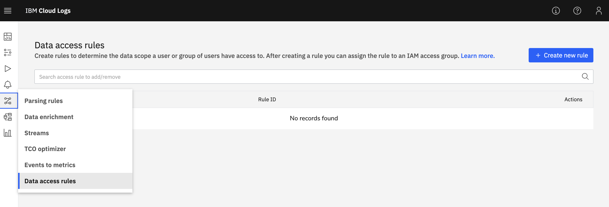
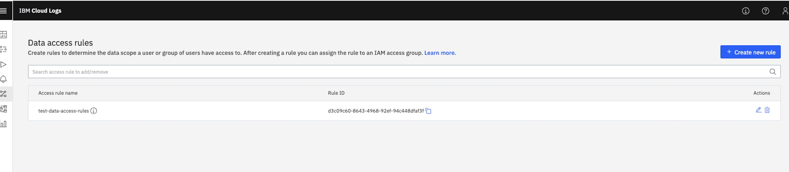
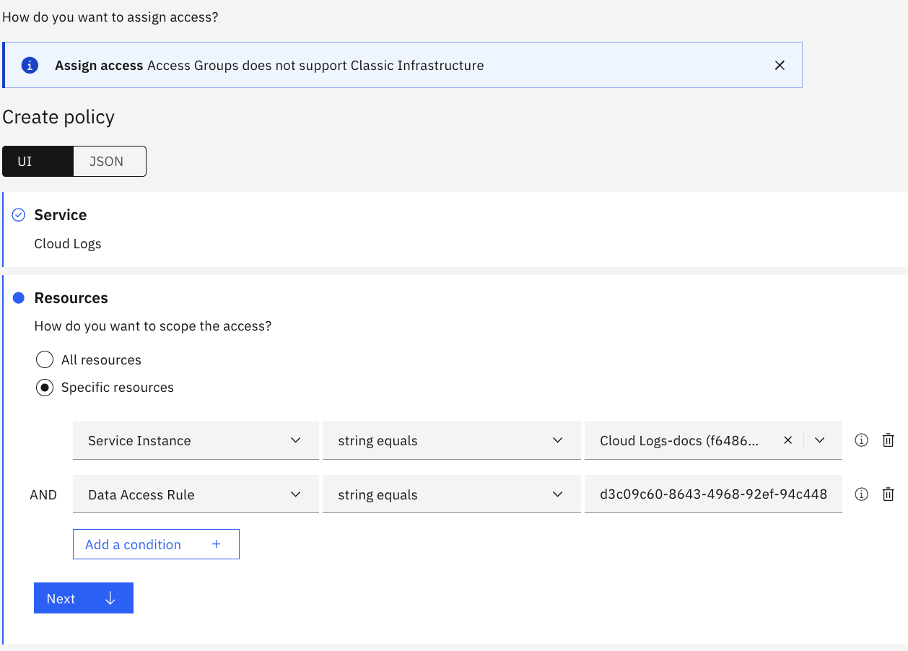

---

copyright:
  years:  2024
lastupdated: "2024-11-18"

keywords:

subcollection: cloud-logs

---

{{site.data.keyword.attribute-definition-list}}

# Data access rules
{: #data-access-rules}

Use the data access rules feature to comply with security and regulatory standards by restricting access to data by authorized users only.
{: shortdesc}

You can define and enforce data access rules, that is, policies, for granting and managing access to data, ensuring that only authorized individuals can view information based on their roles and permissions.

When you configure data access rules, you must complete these tasks:

- Configure in {{site.data.keyword.iamlong}} (IAM) policies that specify the permissions granted to users or trusted profiles to operate the service, and the permissions on the data access rules that determine what data is authorized for those users to see.

- Configure in {{site.data.keyword.logs_full_notm}} data access rules that define policies of what data is visible.

It is your responsibility to validate each data access rule. Verify that the data that is filtered by the data access rule only reports the data that you want returned.
{: important}

## Prerequisites
{: #data-access-rules-prereqs}

- An {{site.data.keyword.cloud_notm}} account.
- An {{site.data.keyword.logs_full_notm}} instance.
- Permisisons in {{site.data.keyword.cloud_notm}} to configure policies.
- Permissions in {{site.data.keyword.logs_full_notm}} to configure data access rules. You need the role **Manager** that includes the action **logs.data-usage.manage**. For more information, see [Getting started with IAM](/docs/cloud-logs?topic=cloud-logs-iam).

## Create a rule in the {{site.data.keyword.logs_full_notm}} service
{: #data-access-rules-1}
{: step}

Complete the following steps:

1. Navigate to your {{site.data.keyword.logs_full_notm}} instance: **Observability** > **Logging** > **Cloud Logs** > *Your Service Instance* > **Open Dashboard**.

2. In the dashboard, click **Data Pipeline** > **Data Access Rules**.

   {: caption="Service instance dashboard." caption-side="bottom"}

3. Click **+ Create new rule** to create a new rule.

    - Enter a name.

    - Enter a query by using a DataPrime Expression Language (DPXL) to match your desired log data.

      `<v1>` is the version identifier, which is followed by the actual boolean expression, including literals, logical and comparison constructs, keypath access, and functions.

      For more information on DPXL, see [DataPrime Expression Language (DPXL) reference](/docs/cloud-logs?topic=cloud-logs-dpxl_ref).

      For example, you can use the DataPrime Expression language (DPXL) example: `<v1>$m.severity == ERROR` to filter log records that have severity of type error.

      See the [DPXL examples](/docs/cloud-logs?topic=cloud-logs-dpxl_ref#dpxl_examples) which you can use as a basis for your DPXL expressions.

4. Click **Create**.

5. Copy the *Rule ID* of the created rule.

   {: caption="Created new rule." caption-side="bottom"}

## Configure an IAM policy to work with the service
{: #data-access-rules-2}
{: step}

This step is required only once per user, per access group or per trusted profile.
{: note}

Complete the following steps to grant permissions to users or trusted profiles through an access group to work with the service:

1. In the IBM Cloud console, click **Manage** > **Access (IAM)**.

2. Select **Access Groups**, or **Users**, or **Trusted profiles**.

3. From the Access tab, click **Assign access**.

4. Select the `Cloud Logs` service and click **Next**.

5. In the *Resources* section, set the scope to specific resources based on selected resource attributes.

    Select **Specific resources**.

    Choose `Service Instance`.

    Select the instance where you want to enforce data access rules.

    Click **Next**.

6. In the *Roles and Actions* section, select the platform role that defines the permissions to operate the service in {{site.data.keyword.cloud_notm}} and the service role that defines the permissions to work with the service.

   - Platform role: The minimum permission that you must grant is **Viewer** so a user can see the instance in the `Observability` UI and launch the dashboard.

   - Service role: The minimum permission that you must grant is **Reader** so a user can access the {{site.data.keyword.logs_full_notm}} UI for the instance selected and view data through views and dashboards provided, for example.

7. Click **Review** > **Assign** to assign added access to your access group.

8. Click **Create**.

## Configure an IAM policy to assign a data access rule
{: #data-access-rules-3}
{: step}

You must define a data access rule policy for each data access rule in your {{site.data.keyword.logs_full_notm}} instance for which you plan to grant access.
{: important}

Complete the following steps to grant permissions on data filtered through a data access rule:

1. In the IBM Cloud console, click **Manage** > **Access (IAM)**.

2. Select **Access Groups**, or **Users**, or **Trusted profiles**.

3. From the Access tab, click **Assign access**.

4. Select the `Cloud Logs` service and click **Next**.

5. In the *Resources* section, set the scope to specific resources based on selected resource attributes.

    Select **Specific resources**.

    Choose `Service Instance`. Then, select the instance where you want to enforce data access rules.

    Choose `Data access rule`. Then, paste the `Rule ID` of the created rule in the **Data Access Rule** condition. You can get the rule ID from the {{site.data.keyword.logs_full_notm}} UI by opening the Data Access Rule feature.

    {: caption="Scope the access to specific resources." caption-side="bottom"}

    Click **Next**.

6. In the *Roles and Actions* section, select the service role **Data Access Reader**.

7. Click **Review** > **Assign** to assign added access to your access group.

8. Click **Create**.

## Verify a data access rule
{: #data-access-rules-4}
{: step}

To check a data access rule is working as you expect, complete the following steps:

- Create a view with the query that maps your data access rule data scope. Then, check that the data filtered is the one you are expecting for that query.

- Validate with a user, a user in an access group, or a user that logs in with a trusted profile that they can only see the data as you see it in the view that you have created to filter data like the condition in the data access rule.
