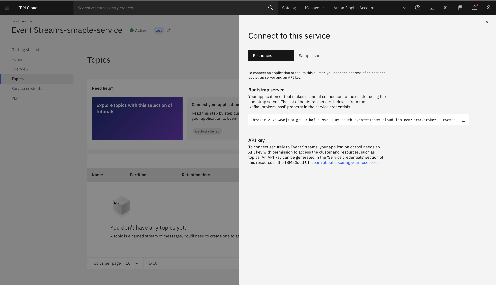
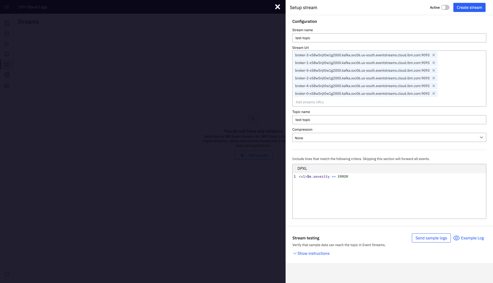

---

copyright:
  years:  2024
lastupdated: "2024-07-04"

keywords:

subcollection: cloud-logs

---

{{site.data.keyword.attribute-definition-list}}


# Set up event streams for {{site.data.keyword.logs_full_notm}}
{: #event-streams-cloud-logs}

You can leverage {{site.data.keyword.es_full_notm}} in conjunction with {{site.data.keyword.logs_full_notm}} to stream and manage log data effectively. {{site.data.keyword.es_full_notm}} is a scalable, managed Apache Kafka service that allows applications to send data by creating messages and sending them to a topic. Applications can subscribe to these topics to receive messages, enabling real-time data processing and analytics.

By integrating {{site.data.keyword.logs_full_notm}} with {{site.data.keyword.es_full_notm}}, you can set up authorization policies, configure topics, and establish secure connections to stream logs seamlessly and monitor your applications more efficiently.
{: shortdesc}

## Prerequisites
{: #event-streams-prereqs}

- An IBM Cloud account.
- You have {{site.data.keyword.logs_full_notm}} instances provisioned in your account.

## What to Expect
{: #event-streams-what}

When integrating IBM {{site.data.keyword.logs_full_notm}} with {{site.data.keyword.es_full_notm}}, here’s what you can expect:

- Streamlined Log Management: Efficiently manage and monitor log data using IBM {{site.data.keyword.logs_full_notm}} integrated with {{site.data.keyword.es_full_notm}}.
- Real-Time Data Processing: Utilize {{site.data.keyword.es_full_notm}} to enable real-time data processing and analytics for your log data.
- Configuration Flexibility: Configure topics and customize log data handling to meet your specific application needs.

## Integration steps
{: #event-streams-steps}

1. Provision {{site.data.keyword.es_full_notm}} Service
   - Navigate to the IBM Cloud Catalog and select {{site.data.keyword.es_full_notm}}.
   - Provision a new {{site.data.keyword.es_full_notm}} Service. You can name it as you prefer.

2. Set Up Authorization Policy
   - While the service is provisioning, navigate to the IBM Cloud navbar and go to _Manage > Access (IAM) > Authorizations_.
   - Create a new Authorization policy:
     - Set {{site.data.keyword.logs_full_notm}} as the source service.
     - Set {{site.data.keyword.es_full_notm}} as the target service.
     - Optionally, bind the Authorization policy to specific resource instances for both services for enhanced security.
     - Assign the Writer Role and click Review. 
     - Verify the details and click Authorize.

3. Create Service Credentials for {{site.data.keyword.es_full_notm}}
   - Navigate to the {{site.data.keyword.es_full_notm}} service under the **Integration** section in the IBM Cloud Resource List.
   - If you do not already have **Service Credentials**, create a new one:
     - On the {{site.data.keyword.es_full_notm}} offering page navigate to the **Service Credentials** section.
     - Create a new Service Credential and name it as you like.
     - Copy the Service Credential details. It should look like this:
     ```json
     {
       "api_key": "GENERATED_API_KEY",
       "bootstrap_endpoints": "<LIST_OF_BROKER_ENDPOINTS>",
       "kafka_admin_url": "URL",
       "kafka_brokers_sasl": [
         "BROKER_1",
         "BROKER_2"
       ],
       "password": "GENERATED_API_KEY",
       "user": "token"
     }
     ```

4. Create a Topic in {{site.data.keyword.es_full_notm}}
   - On the {{site.data.keyword.es_full_notm}} offering page go to the **Topics** section and click _Create Topic_.
   - Enter a name for the topic.
   - Choose appropriate partitioning.
   - Set a retention period for how long messages should be retained.
   
5. Connect to {{site.data.keyword.es_full_notm}}
   - Once the topic is added, click Connect to this service.
   - Under the Resources section Copy over the provided bootstrap-server list 
   - Under the Sample Code Section in the same page,
   - Use the provided snippet to create a properties file, in order for Kafka tools to connect securely to this {{site.data.keyword.es_full_notm}} instance. Just copy over the the code snippet available there to your console, replacing the values in '<brackets>' with the values from the Service credentials page (Step 3).

    

6. Set Up Connection in {{site.data.keyword.logs_full_notm}} Service
   - Navigate to your {{site.data.keyword.logs_full_notm}} Instance: _Observability > Logging > {{site.data.keyword.logs_full_notm}} > Your Service Instance > Open Dashboard_.
   - In the dashboard, go to _Data Pipeline > Streams_.
   - Create a new stream by pressing the '_+ Add Stream_' button:
     - Enter a name.
     - In the Stream URL section, paste the bootstrap-server list from step 5.
     - Provide the topic name and a query to match logs against (e.g., `<v1>$m.severity == ERROR`).
  
    

7. Send Sample Log and Verify Connection
   - Click Send sample log to test the connection. You should see the sample message in your console within a minute.

8. Activate and Create Stream
   - Once you verify that the sample log is successfully received, set the Event Stream to active and click Create Stream.
   - Your {{site.data.keyword.es_full_notm}} will now filter and receive messages according to the specified query.

By following these steps, you have successfully set up IBM {{site.data.keyword.logs_full_notm}} to stream messages to IBM {{site.data.keyword.es_full_notm}}.
