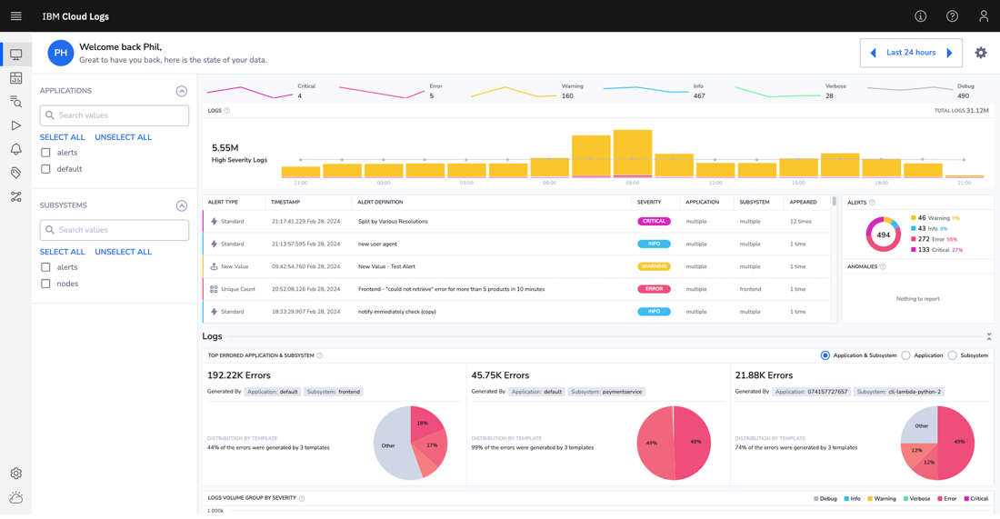

---

copyright:
  years:  2023, 2024
lastupdated: "2024-03-28"

keywords:

subcollection: cloud-logs

---

{{site.data.keyword.attribute-definition-list}}

# Optimize observability with {{site.data.keyword.logs_full_notm}} to help improve infrastructure and app performance
{: #getting-started}

Learn about the planned {{site.data.keyword.logs_full_notm}} service.
{: shortdesc}

This information is provided as a preview of a new service planned to be available in late 2Q 2024. The information included is subject to change.
{: important}

A dilemma exists today with application workloads and observability for fast, effective, and cost-efficient performance management. As workloads generate an expanding amount of observability data, it puts increased pressure on collection tool abilities to process it all and the resulting data stress becomes expensive to manage and makes it harder to obtain actionable insights from the data itself.

Clients seek to right-size their data while retaining conscientious security and compliance requirements. 

To help clients address observability data challenges, {{site.data.keyword.cloud_notm}} is proud to announce its next-generation cloud logging solution {{site.data.keyword.logs_full_notm}}. {{site.data.keyword.logs_full_notm}} is designed to help users to take control of their observability data and expedite insights to reduce application downtime. 

{{site.data.keyword.logs_full_notm}} will initially be available for General Availability (GA) in summer 2024 in Frankfurt and Madrid with day-one support for EU-Managed controls. The service will continue its world-wide multizone region roll-out through 3Q 2024. Instances of {{site.data.keyword.logs_full_notm}} will be provisioned through the {{site.data.keyword.cloud_notm}} Catalog. Provisioning can also be implemented through API and Terraform enabling, you to codify your environments. 

## Collect and aggregate data within and outside {{site.data.keyword.cloud_notm}}
{: #cs-collect}

Comprehensive environments include many sources of data. Out of the box, {{site.data.keyword.logs_full_notm}} will support integration with many common workload environments on {{site.data.keyword.cloud_notm}}. Red Hat Openshift on IBM Cloud, IBM Cloud Kubernetes Services (IKS), VSI and IBM Power amongst others are just a start. 

Unique With {{site.data.keyword.logs_full_notm}}, you may flow your application logs and your IBM Cloud Activity Tracker events into the service giving you flexibility for how you handle your data. You may flow the data to separate instances or combine the data into a single instance to expand your observability insights.

{: caption="Figure 1. {{site.data.keyword.logs_full_notm}} Home dashboard" caption-side="bottom"}

## Quickly cut through data noise
{: #cs-noise}

{{site.data.keyword.logs_full_notm}} processes incoming data and applies machine learning algorithms including log aggregation and anomaly detection to help users cut through data noise to hone into the root cause of the issue. Sophisticated alert rules may be configured in the tool by customers to help reduce triage time. Examples include the following:

* Being notified when a combination of alert events happen within a defined set of criteria; and,

* Receiving alerts when new errors or log types are detected, or when there are anomalous values on established data.

To further help you process the logs and amplify the value of incoming data, With {{site.data.keyword.logs_full_notm}} solution, users can parse incoming data to turn log data into actionable metrics. 

* {{site.data.keyword.logs_full_notm}} parsing tools help you evaluate which data is less essential or redundant. Restructuring the data makes it easier to aggregate dissimilar sources into signals of information your teams need to find and address incidents fast. 

* Oftentimes a simple spark-line of frequency over time will provide the needed insight to quickly narrow in on the problem. {{site.data.keyword.logs_full_notm}} is designed to convert your log data into metrics to summarize what is happening. Using metrics from log data is an efficient way to look at vast amounts of data quickly when you are searching on everything. 

## Search on all retained data
{: #cs-search}

The next generation of logging on IBM Cloud enables you to search all of your retained data and is easily queried within the service. Data is stored on IBM Cloud Object Storage in a search friendly format to allow for rapid search results. When logs rapid search results are needed, data can be additionally hosted using hot storage for priority insights into your data. Query results appear in the same tool and configured set of dashboards you use for operations.

{{site.data.keyword.logs_full_notm}} gives you the tools to query your data effectively from the simplest of queries using Boolean search to advanced using Regex and technology-based queries on Apache Lucene®. {{site.data.keyword.logs_full_notm}} uses the query experience with its in-service query language. Build your query with prompted add-on help to construct queries that can handle your more complex analysis needs.

## Operate efficiently
{: #cs-efficient}

{{site.data.keyword.logs_full_notm}} offers you the tools to quickly assemble dashboards to better visualize your environment. Preconfigured alerts and dashboards for common application environments can be tailored to your environment needs. Dashboard insights paired with {{site.data.keyword.logs_full_notm}}’ machine learning analytics give SRE’s the opportunity to quickly identify the start of an incident more rapidly before it becomes a multi-alarm fire. 

{{site.data.keyword.logs_full_notm}} supports alert incident management within the service helping you to manage operational control of your workloads. Comprehensive environments with maintenance windows can be managed within the tool. When more complex incidents occur, which triggers layers of alarms, users can gain fast command and visualize the situation within the tool, even helping to suppress alerts to downstream alert management solutions and help address alert fatigue.

## Multi-tool friendly
{: #cs-multitool}

{{site.data.keyword.logs_full_notm}} as a service is designed to integrate with the most common applications and systems management tools to fit within your toolchains. Sharing data with other operational tooling is built-in by design:

* Integrate with alert management tools: {{site.data.keyword.logs_full_notm}} supports webhook values within alert messages enabling information to be shared within the alert and allowing users to quickly connect to the source of the trigger. 

   * Share alert data with the IBM Event Notification service for a comprehensive IBM Cloud alert management visibility and control; and

   * Share alert data with PagerDuty and other specialized alert management tools.

*	Integrate with downstream observability, SIEM, and data analysis tools: {{site.data.keyword.logs_full_notm}} will send data to IBM Event Streams, a Kafka service implementation, where data may be shared with a wide variety of tools and applications.

* Integrate with your workloads and bespoke tools: {{site.data.keyword.logs_full_notm}} supports launching into and out of the service with a defined set of parameters enabling you to automate and streamline your SRE or users’ ability to nimbly navigate the comprehensive workloads and maintain smooth context switching between tools.

## Optimize log value to match your observability budget
{: #cs-optimize}

All data is not valued equally; {{site.data.keyword.logs_full_notm}} helps manage this to optimize the value of log data you keep. To guide you while reviewing your observability needs and budget, the solution offers you three tiers of log and event processing to select from:

* Store and search: Data you retain primarily for compliance obligations may be stored and searched as necessary at a low cost/GB. 

* Analyze and alert: Log and event data with analysis and alert value is processed as a mid-tier cost/GB. The mid-tier includes adding definition of metrics from logs, allowing you to visualize trends and prepare for future incidents quickly. 

* Priority insights: Select and configure the most critical and highest value data to your operation for priority query results. Data logs in this tier are retained in hot storage.

## {{site.data.keyword.logs_full_notm}} availability
{: #cs-avail}

{{site.data.keyword.logs_full_notm}} is IBM’s strategic cloud logging platform for the future and provides replacement function for both the {{site.data.keyword.la_full_notm}} and {{site.data.keyword.at_full_notm}} services.[{{site.data.keyword.la_full_notm}}](/docs/log-analysis?topic=log-analysis-deprecation) and [{{site.data.keyword.at_full_notm}}](/docs/activity-tracker?topic=activity-tracker-deprecation) are deprecated and have an end of service and end of life on 30 March 2025.

A migration tool will be released in 2Q 2024 for clients migrating from {{site.data.keyword.la_full_notm}} and {{site.data.keyword.at_full_notm}} services. During the migration period clients may be using both sets of tools and will be charged accordingly. The tool will migrate your currently configured alerts, dashboards, views and other settings into an {{site.data.keyword.logs_full_notm}} instance. Terraform output will also be supported for users needing to codify their deployments and configurations. 

In conclusion, it is possible to take control of your observability data with {{site.data.keyword.logs_full_notm}}. IBM Cloud’s next-generation logging solution is designed to help you to collect and aggregate data within and outside IBM Cloud, quickly cut through data noise, search on all retained data, visualize your environment, integrate into your multi-tools and to optimize log value to match your observability budget.

