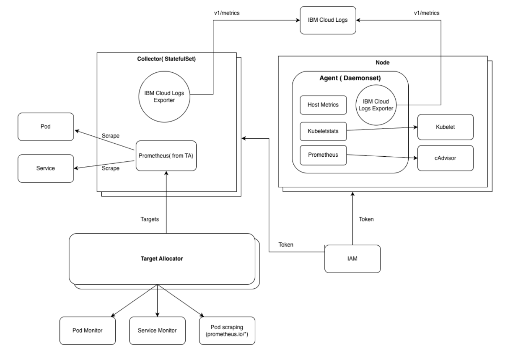

---

copyright:
  years:  2024, 2026
lastupdated: "2026-05-15"

keywords:

subcollection: cloud-logs

---

{{site.data.keyword.attribute-definition-list}}

# About the OTel collector
{: #otel-collector}

You can deploy the OTel collector in a Kubernetes or OpenShift cluster to ingest telemetry data from multiple sources, transform the data, and export it to an {{site.data.keyword.logs_full_notm}} instance for analysis.
{: shortdesc}

## Architecture for collecting metrics in orchestrated environments
{: #otel-collector-arch-orchestrated}

The OTel collector uses a three-tier architecture to balance node-level performance with cluster-wide scalability.

The following diagram shows the high level view of the three tier architecture that is used to collect and send metrics to an {{site.data.keyword.logs_full_notm}} instance:

{: caption="Metrics collection architecture for orchestrated environments" caption-side="bottom"}

The **daemonSet**, known as the icl-shipper-agent, deploys a pod on each node of the cluster to collect node-local telemetry only.

A **statefulSet**, known as the icl-shipper-collector, is deployed acting as a cluster-wide scraping and aggregation layer.
- Minimum 2 replicas are required for high availability.
- Provides stable pod identities that are required by the *Target Allocator*.
- Uses persistent storage for metric queues to help prevent data loss during backend outages.
- Configured with a 60-second graceful shutdown period to flush queues during rollouts.

The **target allocator**, known as the icl-shipper-targets-allocator, discovers scrape targets via Prometheus Custom Resource Definitions (CRD) and distributes the workload across the Collector replicas.
- Uses consistent-hashing to ensure even distribution and minimize metric "churn" during scaling.
- Minimum 2 replicas are required for high availability.
- Automatically monitors the cluster for Prometheus Operator CRDs.

## Metrics collected in orchestrated environments
{: #otel-collector-metrics-orchestrated}

The following metrics are collected:

1. Node-local telemetry collected through the Daemonset tier:

    - **Host metrics**: CPU, memory, disk, filesystem, network, load, paging, and process metrics via hostmetrics receiver accessing `/hostfs`.

    - **Kubelet metrics**: Container and pod resource usage via kubeletstats receiver.

    - **cAdvisor metrics**: Detailed container metrics scraped from kubelet's /metrics/cadvisor endpoint via prometheus receiver.

2. Cluster and application telemetry collected through the StatefulSet tier:

    - **Cluster metrics**: Nodes, deployments, pods, namespaces via k8s_cluster receiver.

    - **Application metrics**: Scraped from ServiceMonitor/PodMonitor targets via prometheus/target-allocator receiver.

    - **Collector self-monitoring metrics**: Collector's own internal metrics.

## Requirements for orchestrated environments
{: #otel-collector-requirements-orchestrated}

Review the requirements to deploy the collector in an orchestrated environment:

-Agent (DaemonSet):

    CPU: 200m request, 1000m limit

    Memory: 512Mi request, 1Gi limit

-Collector (StatefulSet):

    Minimum 2 replicas for high availability

    CPU: 500m request per replica

    Memory: 1Gi request per replica

-Persistent storage:

    10Gi per replica (for queue persistence)

-Target Allocator (Deployment):

    Minimum 2 replicas for high availability

    CPU: 100m request

    Memory: 256Mi request
