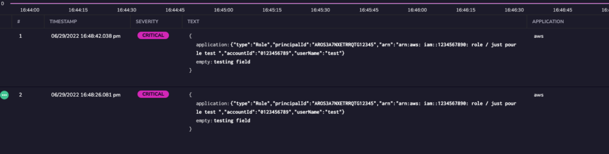
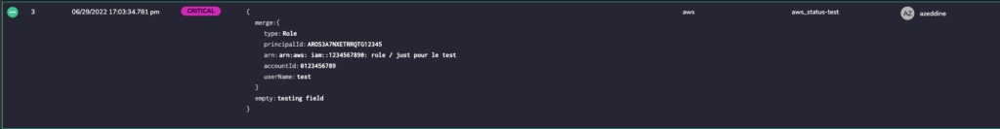

---

copyright:
  years:  2024, 2025
lastupdated: "2025-10-02"

keywords:

subcollection: cloud-logs

---

{{site.data.keyword.attribute-definition-list}}

# Converting a JSON string to JSON object by using the Parse JSON field rule
{: #parse-convert-to-json-object}

In {{site.data.keyword.logs_full}}, you can use the *Parse JSON field* rule to transform escaped or stringified logs to JSON format.
{: shortdesc}

If you chose a destination field that causes a mapping exception, a message is displayed to tell you that you are creating an exception if you apply the rule.
{: note}

## Before you begin
{: #parse-convert-to-json-object-1}

Parsing rules are organized inside *Rule Groups*. Each group has a name and a set of rules with a logical relationship between them. Logs are processed according to the order of rule group (from the beginning to the end). They are then processed by the order of rules within the rule group and according to the logical operators between them (`AND/OR`). Rules help you to process, parse, and restructure log data to prepare for monitoring and analysis. For more information, see [Working with rule groups](/docs/cloud-logs?topic=cloud-logs-rules_groups).

## Configuring a Parse JSON field rule
{: #parse-convert-to-json-object-3-ui}

Complete the following steps:

1. Click the **Data pipeline** icon  > **Parsing rules** and click **New Rule Group**.

2. In the **Details** section, enter the *Rule Group Name* and the *Rule Group Description*.

3. In the **Rule Matcher** section, configure the applications, subsystems, and severities that define the logs on which to apply the rules that are included in the rules group.

4. In the **Rules** section, select **Parse JSON field** .

   1. Enter a name.

   2. Optionally, enter a description.

   3. For **Source Field**, enter the field you want to convert to text.

   4. Configure if you want to merge into or overwrite the destination field.

      - Select **Merge Into** if you want to keep the original field with its content and merge the change.

      - Select **Overwrite** if you want to overwrite the original field and its content.

   5. For **Destination Field**, enter the field where you want the content of the source to be saved.

   6. Configure if you want to keep or delete the source field.

      - Select **Keep** if you want to keep the original field with its content.

      - Select **Delete** if you want to delete the original field and its content.

    Toggle the status to **ACTIVE** if you want the rule to be enabled.

5. Add additional rule groups by clicking **Add Rule** and selecting the desired rule type. Toggle **AND**/**OR** to select how you would like the additional rules processed.

6. Click **Create Rule Group**.

## Example: Removing escaping characters and formating to JSON
{: #parse-convert-to-json-object-4}

In this example, we are unescaping the log and making it in JSON format.

{: caption="Original log." caption-side="bottom"}

{: caption="Parse JSON example." caption-side="bottom"}

{: caption="Modified log." caption-side="bottom"}
