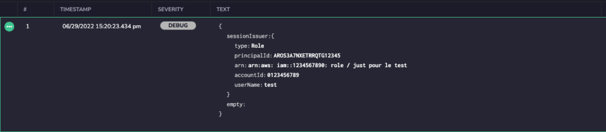
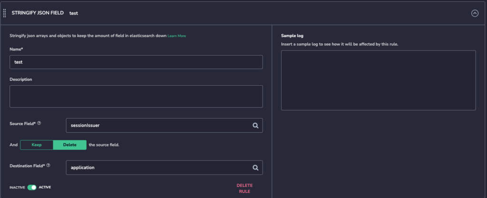
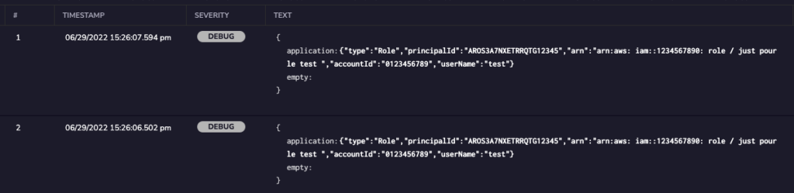
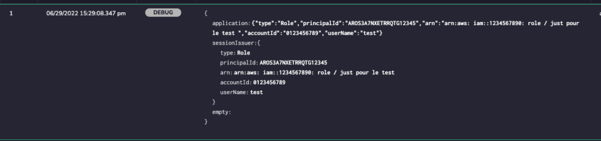

---

copyright:
  years:  2024
lastupdated: "2024-06-13"

keywords:

subcollection: cloud-logs

---

{{site.data.keyword.attribute-definition-list}}

# Converting a JSON object to JSON string by using the Stringify JSON field rule
{: #parse-convert-to-json-string}

In {{site.data.keyword.logs_full}}, you can use the *Stringify JSON field* rule to reduce the amount of indexed fields stored for search.
{: shortdesc}

Using this rule, you can change an array or an object from JSON format to text to reduce the number of fields. However, this still keeps the data in {{site.data.keyword.logs_full}} to be searchable by using free text search.
{: note}

## Before you begin
{: #parse-convert-to-json-string-1}

Parsing rules are organized inside *Rule Groups*. Each group has a name and a set of rules with a logical relationship between them. Logs are processed according to the order of rule group (from the beginning to the end). They are then processed by the order of rules within the rule group and according to the logical operators between them (`AND/OR`). Rules help you to process, parse, and restructure log data to prepare for monitoring and analysis. For more information, see [Working with rule groups](/docs/cloud-logs?topic=cloud-logs-rules_groups).

## Configuring a Stringify JSON field rule
{: #parse-convert-to-json-string-3-ui}
{: ui}

Complete the following steps:

1. Click the **Data pipeline** icon  > **Parsing rules** and click **New Rule Group**.

2. In the **Details** section, enter the *Rule Group Name* and the *Rule Group Description*.

3. In the **Rule Matcher** section, configure the applications, subsystems, and severities that define the logs on which to apply the rules that are included in the rules group.

4. In the **Rules** section, select **Stringify JSON field** .

    Enter a name.

    Optionally, enter a description.

    For **Source Field**, enter the field you want to convert to text.

    Configure if you want to keep or delete the source field.

    - Select **Keep** if you want to keep the original field with its content.

    - Select **Delete** if you want to delete the original field and its content.

    For **Destination Field**, enter the field where you want the content of the source to be saved.

    Toggle the status to **ACTIVE** if you want the rule to be enabled.

5. Add additional rule groups by clicking **Add Rule** and selecting the desired rule type. Toggle **AND**/**OR** to select how you would like the additional rules processed.

6. Click **Create Rule Group**.

## Configuring a Stringify JSON field rule using the API
{: #parse-convert-to-json-string-3-api}
{: api}

Complete the following steps:

## Sample
{: #parse-convert-to-json-string-4}

In the following example, the `sessionIssuer` field, which is an object, is changed to text and given the name `application`.

{: caption="Original log." caption-side="bottom"}

{: caption="Stringify JSON example." caption-side="bottom"}

{: caption="Results with Delete selected for Source Field." caption-side="bottom"}

{: caption="Results with Keep selected for Source Field." caption-side="bottom"}
