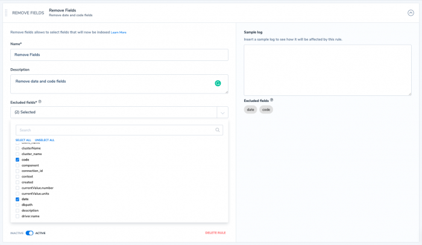

---

copyright:
  years:  2024, 2025
lastupdated: "2025-05-16"

keywords:

subcollection: cloud-logs

---

{{site.data.keyword.attribute-definition-list}}

# Removing fields from logs by using the Remove fields rule
{: #parse-remove-rule}

In {{site.data.keyword.logs_full}}, you can use the *Remove fields* rule to select fields that will not be indexed.
{: shortdesc}

Using the remove fields rule, you can drop specific fields from any JSON log entry that contains them, which is not always an option at run-time.

Having a cleaner structure for your logs helps give you better visibility into your data.

## Before you begin
{: #parse-remove-1}

Parsing rules are organized inside *Rule Groups*. Each group has a name and a set of rules with a logical relationship between them. Logs are processed according to the order of rule group (from the beginning to the end). They are then processed by the order of rules within the rule group and according to the logical operators between them (`AND/OR`). Rules help you to process, parse, and restructure log data to prepare for monitoring and analysis. For more information, see [Working with rule groups](/docs/cloud-logs?topic=cloud-logs-rules_groups).

## Configuring a Remove fields rule
{: #parse-remove-3-ui}
{: ui}

Complete the following steps:

1. Click the **Data pipeline** icon  > **Parsing rules** and click **New Rule Group**.

2. In the **Details** section, enter the *Rule Group Name* and the *Rule Group Description*.

3. In the **Rule Matcher** section, configure the applications, subsystems, and severities that define the logs on which to apply the rules that are included in the rules group.

4. In the **Rules** section, select **Remove fields** .

    1. Enter a name.

    2. Optionally, enter a description.

    3. Enter the list of excluded fields.

    4. Toggle the status to **ACTIVE** if you want the rule to be enabled.

5. Add additional rule groups by clicking **Add Rule** and selecting the desired rule type. Toggle **AND**/**OR** to select how you would like the additional rules processed.

6. Click **Create Rule Group**.

## Sample: Removing fields from a log
{: #parse-remove-4}
{: ui}

The following steps can be used to remove fields from a log.

1. Name your rule and give it a meaningful description.

2. Click **Excluded fields**. This lists all fields that are mapped to your indices.

3. Select the field to exclude.

    {: caption="Selecting fields to exclude from your logs." caption-side="bottom"}

4. Use the sample logs to verify your rule is working as intended.

5. Save your rule.
