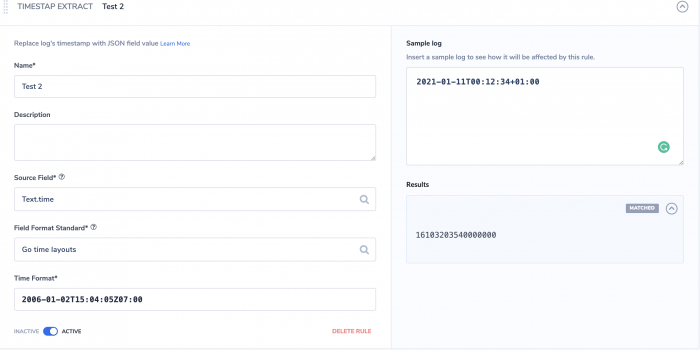
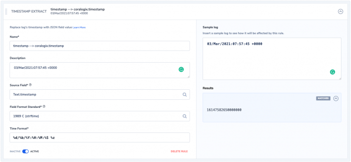
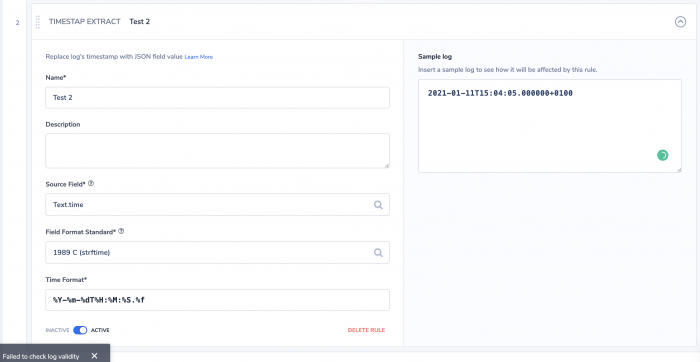

---

copyright:
  years:  2024
lastupdated: "2024-06-13"

keywords:

subcollection: cloud-logs

---

{{site.data.keyword.attribute-definition-list}}


# Replacing the timestamp of logs by using the Timestamp Extract rule
{: #parse-replace-timestamp}

In {{site.data.keyword.logs_full}}, you can use the *Timestamp Extract* rule to replace the log's timestamp with the value of your custom timestamp field from your log.
{: shortdesc}

The timestamp for each log entry is assigned by the receiving endpoint when logs arrive. Using the timestamp extract rule, you can override the timestamp for the log entry with the value of your custom timestamp field from your log.

When you are configuring this rule, make sure you choose the correct source field, then choose the desired field format standard. Finally, you need to edit the time format option with the format that matches your log's time field.


## Before you begin
{: #parse-replace-timestamp-1}

Parsing rules are organized inside *Rule Groups*. Each group has a name and a set of rules with a logical relationship between them. Logs are processed according to the order of rule group (from the beginning to the end). They are then processed by the order of rules within the rule group and according to the logical operators between them (`AND/OR`). Rules help you to process, parse, and restructure log data to prepare for monitoring and analysis. For more information, see [Working with rule groups](/docs/cloud-logs?topic=cloud-logs-rules_groups).


## Configuring a Timestamp extract rule
{: #parse-replace-timestamp-3-ui}
{: ui}

Complete the following steps:

1. Click the **Data pipeline** icon  > **Parsing rules** and click **New Rule Group**.

2. In the **Details** section, enter the *Rule Group Name* and the *Rule Group Description*.

3. In the **Rule Matcher** section, configure the applications, subsystems, and severities that define the logs on which to apply the rules that are included in the rules group.

4. In the **Rules** section, select **Timestamp extract** .

    1. Enter a name.

    2. Optionally, enter a description.

    3. Select a *Source Field*. This is the field on which the RegEx is applied.

    4. Select a *Field Format Standard*. Valid formats are: `Java SimpleDateFormat`, `1989 C (strftime)`, `Go time layouts`, `Unix timestamp`, `Unix milli-timestamp`, `Unix micro-timestamp`, and `Unix nano-timestamp`.

    5. Enter a *Time Format*. For example, you can use `%Y-%m-%dT%H:%M:%S.%f%z`.

    6. Toggle the status to **ACTIVE** if you want the rule to be enabled.

5. Add additional rule groups by clicking **Add Rule** and selecting the desired rule type. Toggle **AND**/**OR** to select how you would like the additional rules processed.

6. Click **Create Rule Group**.


## Configuring a Timestamp extract rule using the API
{: #parse-replace-timestamp-3-api}
{: api}

Complete the following steps:


## Example: Converting the log timestamp
{: #parse-replace-timestamp-4}


You can use the sample log tester and expect a match that indicates the rule was able to parse your time field format to the {{site.data.keyword.logs_full}} time format. The {{site.data.keyword.logs_full}} time format is a Unix timestamp in nanoseconds divided by 100 (17 digits).

For example, by using this log entry:

```json
{
  "transaction_ID":12543,
  "worker":"A23",
  "Message":"success",
  "time":"2021-01-11T15:04:05.000000+0100"
}
```
{: codeblock}

You can use the `strftime` standard and set the time format to match the time field string format, which, in this case, also matches the suggested default format.

{: caption="Example timestamp extract that shows strftime standard formatting." caption-side="bottom"}

Saving this rule results in the following log entry:

```json
{
  "transaction_ID":12543,
  "worker":"A23",
  "Message":"success",
  "time":"2021-01-11T00:12:34+01:00"
}
```
{: codeblock}

Now, consider by using the Go time layout standard and set the time format to match the time field string format.

{: caption="Example Timestamp Extract showing Go time layouts standard formatting." caption-side="bottom"}

Saving this rule results in the following log entry:

```json
{
  "transaction_ID":12543,
  "worker":"A23",
  "Message":"success",
  "time":"03/Mar/2021:08:34:12 +0000"
}
```
{: codeblock}

Again, use the `strftime` standard to set the time format to match my time field string format. But in this case the time field format has few differences than the default (`%Y-%m-%dT%H:%M:%S.%f%z`), for example `2021-01-11T15:04:05.000000+0100`. One difference is the month format, which in this case is an abbreviated month name. Referring to the [strftime reference](https://strftime.org/){: extetrnal}, `%b` represents the abbreviated month name format. By using `%b` and adding the other needed changes that you can create the matching format.

{: caption="Example where time field differs from default." caption-side="bottom"}

Saving this rule results in the following log entry:

```json
{
  "transaction_ID":12543,
  "worker":"A23",
  "Message":"success",
  "time":"2021-01-11T15:04:05.000000+0100"
}
```
{: codeblock}

You can incorrectly define your timestamp extract to result in no match. For example, by using the `strftime` standard and ignoring the zone `%z` would result in no match to the original time string format. The time format would need to be corrected before you save the rule or the rule would not work as intended.
{: important}

{: caption="Example incorrect timestamp extract definition." caption-side="bottom"}
