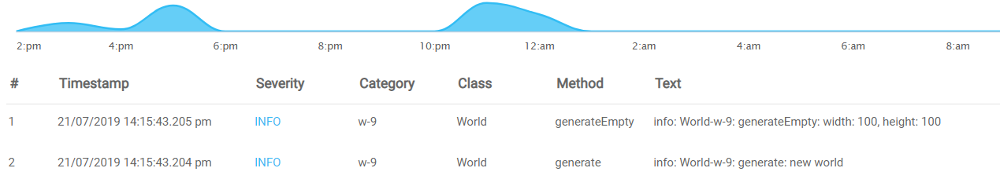

---

copyright:
  years:  2024, 2025
lastupdated: "2025-02-05"

keywords:

subcollection: cloud-logs

---

{{site.data.keyword.attribute-definition-list}}


# Using regex when querying data
{: #query-regex}

Regular expressions (regex) can be used when querying {{site.data.keyword.logs_full_notm}} data for pattern searching and string replacement.
{: shortdesc}

You might want to extract specific data from your logs to make it easier to analyze and visualize. Sometimes you might want to capture specific logged data. Other times, you might need to hide sensitive data in logs before they are saved.

You can also match using a regex pattern rather than an exact text search.

## What is regex and how does it work?
{: #query-regex-what}

Regular Expressions, also known as regex, is a domain-specific language (DSL) used for pattern searches and replacements.

The information in this topic is not intended to give a full educational tutorial on regex. If you are unfamiliar with regex, you might want to review publicly available information on regex before trying to understand the specific concepts included here.
{: tip}

## Regex concepts
{: #query-regex-concepts}

There are some basic concepts you need to know to understand the examples in this topic.

Capture group
:   Regex contained within parenthesis. The operators are applied to the text matching the specification within the parenthesis.

Named capture group
:   A capture group that is associated with a name. The matched results can be referenced by the name

Character class
:   A range of characters to be matched enclosed in square brackets (`[]`). A dash can be used as a shorthand to list several characters: `[1-5]` is the same as `[12345]`.

## When to use regex
{: #query-regex-when}

There are times when you will not need a regular expression and you can just search for a specific text. For example, if you just want to find log lines with the text `user logged in`, you can simply enter this text into your log search. But if your log lines look like this: `user_32 logged in` you can’t search for the exact text since the user ID is a variable that changes.

Fortunately, there is a regex pattern for this case which makes use of the match anything sequence:

```text
user_d+ logged in
```
{: codeblock}

## Using regex to extract text into custom JSON fields
{: #query-regex-extract}

Suppose you have an unstructured log in the following format:

```text
${logLevel}: World-${worldName}: ${logText}
```
{: codeblock}

And, you would like to convert all entries in this format into a JSON object in the following format:

```json
{
    "level": `${log-level}`,
    "tag": `World-${worldName}`,
    "text": `${logText}`
}
```
{: codeblock}

You can use this regex to do the conversion:

```text
^(?P.*?):s*(?P.*?):
```
{: codeblock}

Where:

* `^` is the start of line symbol, it means that the match needs to start with the start of a line.
* `(?PX)` where `X` is what is matched and is the named capturing group syntax. This regex has three capturing groups, one for each JSON key needed.
* `s` means “any whitespace character“.
* `.` means “any one character”.
* `*` means “0 or more matches of the previous symbol or character”.
* `.*` means “1 or more matches of the previous symbol or character”.
* `.*?` means “any characters any number of times, with the least amount of tokens necessary“.

So, the regex:

```text
^(?P.*?):s*(?P.*?):
```
{: codeblock}

Will be processed as follows:

1. Text starting at the start of a line until the first `:` symbol will be captured as the group `level`.

2. After any number of whitespaces, any text until the next `:` symbol will be captured as the group `tag`.

3. The log text is automatically set to the `text` field by {{site.data.keyword.logs_full_notm}}, so we will automatically have the `text` field.

Using the same regex, the following log:

```text
"info: World-w-8: generate: new world"
```
{: codeblock}

Is converted into this JSON object:

```json
{
   "level": "info",
   "tag": "World-w-8",
   "text": "info: World-w-8: generate: new world"
}
```
{: codeblock}

## Extracting text into predefined fields
{: #query-regex-extract-predefined}

You might want to extract text into predefined fields. Consider this log:

```text
"info: World-w-8: generate: new world"
```
{: codeblock}

You might want to extract the `info` text into the `Severity` column, and the `World` text into the `Class` column.

You can modify the regex to set correct names of the capturing groups as follows:

```text
^(?P.*?):s*(?P.*?)-(?P.*?):
```
{: codeblock}

This regex will format the log so it will display as shown.

{: caption="Log display after applying regex formatting" caption-side="bottom"}

## Extracting specific data from structured logs
{: #query-regex-specific}

A similar method can be used to extract data from structured logs. The following is an example showing you how to extract data from a specific JSON field.

Suppose you have a structured log line similar to this:

```json
{
    "type": `${text}`,
    "log": `${text}`,
    "region": "rg-europe-2"
}
```
{: codeblock}

Now, if the `region` field has the following form:

```text
`rg-${"europe"|"asia"|"na"}-${number}`
```
{: codeblock}

We want to extract the part which tells us whether the region is `europe`, `asia` or `na`. The regex to extract the data would be:

```text
"region"s*:s*"rg-(?P.*?)-
```
{: codeblock}

The named capturing group `regionName` is what extracts the text. The region name is after the key name `region` and the characters `rg-` according to our format. The purpose of the `s*` symbols is to make regex still work if there are any whitespaces before or after the `:` symbol.

The result will be similar to the following:

```json
{
    "log" : "Bye",
    "regionName" : "na",
    "region" : "rg-na-1",
    "type" : "ltest-w-9"
}
```
{: codeblock}

## Replacing and removing values
{: #query-regex-replace}

One of the most common examples where we need to replace or remove values is hiding personal data. Suppose you log phone numbers somewhere and don’t want those to be saved in {{site.data.keyword.logs_full_notm}}.

Suppose we have an unstructured log line like this:

```text
"info: Sender: sendSms: sending sms to phone number +12345678910 to user Andrew"
```
{: codeblock}

You want to remove phone number and name from this line. This regex will match the line, starting with "sending sms":

```text
sending sms to phone number +*d+ to user .*
```
{: codeblock}

We need to escape the `+` symbol a blank space because `+` has a special meaning in the regex syntax. This meaning is “1 or more previous characters”.
{: note}

The symbol `d` matches any single digit. Remember, that the `*` symbol means “0 or more previous characters”. So, +*d+ matches one or more digits which can be prepended by a `+` symbol (or not).

This regex will replace the text matched by the previous regex to the same text, but without the phone number and name:

```text
sending sms to phone number * to user *
```
{: codeblock}

And here is the result of applying the above rule:

```text
"info: Sender: sendSms: sending sms to phone number * to user *"
```
{: codeblock}

## Replacing JSON values in structured logs
{: #query-regex-replace-structured}

Replacing JSON values in structured logs is similar to replacing values in unstructured logs. The whole JSON string is used as the input for the [Replace rule](/docs/cloud-logs?topic=cloud-logs-parse-replace-rule&interface=ui).

Using the following JSON structure:

```json
{
   "type": `${text}`,
   "log": `${text}`,
   "region": "rg-europe-2"
}
```
{: codeblock}

Suppose you need to replace the value of the `type` field with another value. Here is how you can match the value of the `type` field:

```text
"type"s*:s*".*?"
```
{: codeblock}

Remember that we need the `s*` symbols to make sure the regex works if there are whitespaces before or after the `:` character.
{: tip}

Here is the regex to replace any value in the `type` field with `newType`:

```text
"type":"newType"
```
{: codeblock}

## Using backreferences
{: #query-regex-backref}

Suppose we need to replace `europe` with `eu` in the strings in the format `west-europe-2`. And suppose we need to do this not only in the `region` field but in any other part of the log where the string is found. Matching this pattern is easily done with this regex:

```text
.+?-europe-d+
```
{: codeblock}

Howerver, replacing the string using the methods we used before might be rather hard. This is because we need to insert two strings before and after the `europe` text, and those strings might vary. To do this, we first need to capture the strings into capturing groups:

```text
(.+?)-europe-(d+) 
```
{: codeblock}

Remember that the `d` symbol means “any digit” and together with `+` it means “any digit one or more times”. In a similar way, `.+` means any symbol one or more times, but with the fewest amount of tokens to make the match.
{: tip}

This regex will capture the text before `europe` as capturing group 1, and the text after `europe` as capturing group 2. The following regex will use backreferences to insert the matched content of those groups:

```text
$1-eu-$2
```
{: codeblock}

For example, a log before applying our rule:

```json
{
    "log" : "Here region is east-europe-1. That's it",
    "type" : "newType",
    "region" : "east-europe-1"
}
```
{: codeblock}

And the log after applying the rule:

```json
{
    "log" : "Here region is east-eu-1. That's it",
    "type" : "newType",
    "region" : "east-eu-1"
}
```
{: codeblock}

## Searching using regex from the logs search bar
{: #query-regex-search}

Another place where you can use regex is the {{site.data.keyword.logs_full_notm}} UI **Logs** page search bar.

When searching from the page search bar you can enter exact text, Lucene, or Dataprime queries. You can also look for particular patterns using regex. Regex queries have their own format which is: 

```text
/${fieldName}.keyword:/REGEX//
```
{: codeblock}

Suppose we have many JSON-structured logs in the following format:

```json
{    
    "log":  `${text}` ,
    "regionName":  `${text}`,
    "region":  `${text}`, 
    "type"  :  `ltest-w-${number}`
}
```
{: codeblock}

And we want to match only those entries where `type` is equal to `ltest-w-1`, `ltest-w-2` or `ltest-w-3`. The following search query will do this:

```text
/type.keyword:/ltest-w-[1-3]//
```
{: codeblock}

The text between square brackets `[` and `]`, is called a *character class*. It matches any one character listed between square brackets. Dash can be used as a shorthand to list several characters: `[1-5]` is the same as `[12345]`.
{: tip}

You can use the same syntax to match data in unstrucutred logs with regex. You only need to set the field name to `text.keyword`. For example:

```text
 /text.keyword:/.*ltest-w-[1-3].*// 
```
{: codeblock}

This regex will search for the text `ltest-w-1`, `ltest-w-2` or `ltest-w-3` in main log body.

## Triggering alerts with regex
{: #query-regex-alerts}

Another popular use case for regex in {{site.data.keyword.logs_full_notm}} is in defining alerts. the alerts syntax is the same as logs query syntax. 

Let’s say we want to alert us on a line of the following form:

```text
`App: init: World-${name}: generation error: ${err}`
```
{: codeblock}

And suppose we want to get alerts only for worlds `w-1`, `w-2`, `w-3` or `w-4`. Our alert regex will look like this:

```text
/text.keyword:/.*World-w-[1-4]: generation error.*//
```
{: codeblock}

Remember, that `[1-4]` matches any single character from `1` to `4`, and `.*` matches any characters any number of times.
{: tip}

For more information about alerts, see:

* [Working with alerts](/docs/cloud-logs?topic=cloud-logs-event-notifications-about)
* [Configuring alerts](/docs/cloud-logs?topic=cloud-logs-alerts-config)
 

