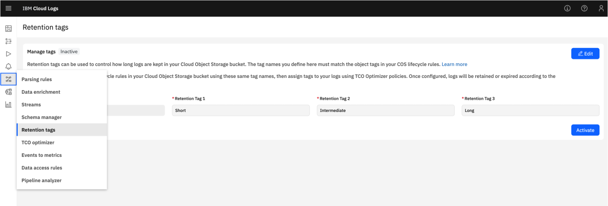
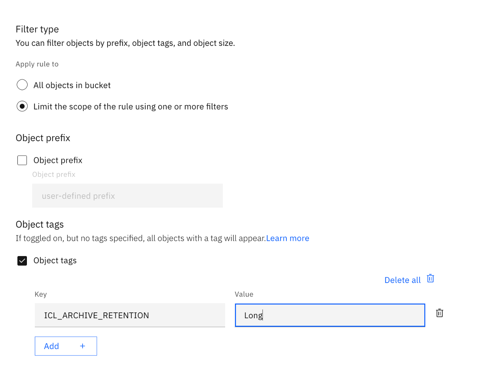
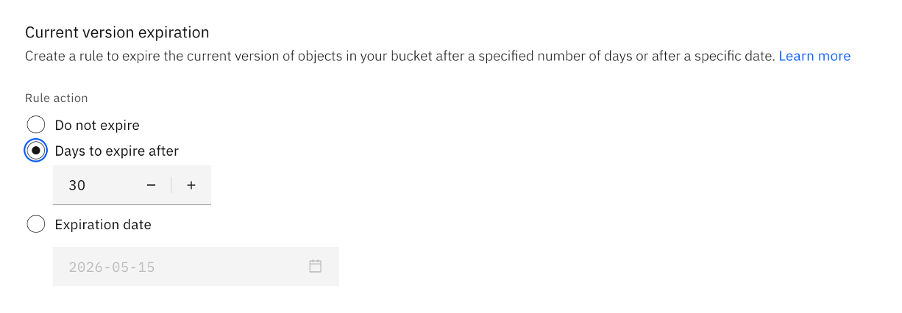
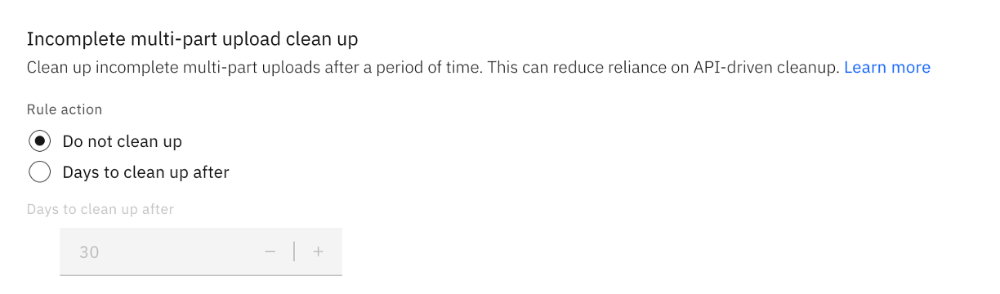

---

copyright:
  years:  2024, 2026
lastupdated: "2026-04-15"

keywords:

subcollection: cloud-logs

---

{{site.data.keyword.attribute-definition-list}}

# Configuring archive retention tags to manage data retention
{: #retention-tags}

In {{site.data.keyword.logs_full_notm}}, you can use {{site.data.keyword.cos_full_notm}} object tags to manage automatically how long log data is available for search in the data bucket.
{: shortdesc}

After you configure the data bucket for an {{site.data.keyword.logs_full_notm}} instance, log data is stored in the bucket and you can search the data. You are responsible for the maintenance of the bucket and the data stored in the bucket.

By default, data in the bucket is kept indefinitely.

To delete objects automatically after a defined period (from the object creation date), you can configure {{site.data.keyword.cos_full_notm}} expiration rules (lifecycle policies) to manage automatically the deletion of object files based on number of days since the object creation date. However, if you want a more granular control on the data that is kept for search in the data bucket and delete files automatically by using different retention periods on the data, you must configure in {{site.data.keyword.cos_full_notm}} expiration rules that limit the scope by using the object tag `ICL_ARCHIVE_RETENTION` and use the tag values that you define in your {{site.data.keyword.logs_full_notm}} instance. For more information, see [Deleting files from the data bucket](/docs/cloud-logs?topic=cloud-logs-about-bucket#about-bucket-cl-data-bucket-maintain).

Archive retention tags are attached to object files that are uploaded into the data bucket after they are defined and enabled in the {{site.data.keyword.logs_full_notm}} instance.

## Prerequisites
{: #retention-tags-prereqs}

- An {{site.data.keyword.cloud_notm}} account.
- An {{site.data.keyword.logs_full_notm}} instance.
- Permissions in {{site.data.keyword.logs_full_notm}} to configure archive retention tags. You need the role **Manager** that includes the action **logs.archive-retention.manage** and **logs.archive-retention.read**. For more information, see [Getting started with IAM](/docs/cloud-logs?topic=cloud-logs-iam).

## Configure custom archive retention tags in {{site.data.keyword.logs_full_notm}}
{: #retention-tags-step1}
{: step}

Complete the following steps:

1. Navigate to your {{site.data.keyword.logs_full_notm}} instance: **Observability** > **Logging** > **Cloud Logs** > *Your Service Instance* > **Open Dashboard**.

2. In the dashboard, click **Data Pipeline** > **Retention Tags**.

    The Archive retention tags page opens.

    {: caption="Archive retention tags." caption-side="bottom"}

3. Click **Activate** to enable this feature.

4. Click **Edit** and enter custom values for 1 or more retention tags. You can also use the predefined values `Short`, `Intermediate` and `Long`.

    Define per tag how data is classified. Each tag is used to define a different retention period of the data. You can define your own values and criteria.{: important}

    If you plan to have different retention policies per TCO data pipeline, enter the following values:

    - **high** for *Retention Tag 1*, where high represents data processed through the {{site.data.keyword.frequent-search}} TCO data pipeline.
    - **medium** for *Retention Tag 2*, where medium represents data processed through the {{site.data.keyword.monitoring}} TCO data pipeline.
    - **low** for *Retention Tag 3*, where low represents data processed through the {{site.data.keyword.compliance}} TCO data pipeline.

    If you plan to have different retention policies per log priority, enter the following values:

    - **debug** for for *Retention Tag 1*, where critical represents data that have a log priority set to `debug` or `verbose`.
    - **info** for for *Retention Tag 2*, where info represents data that have a log priority set to `info` or `warning`.
    - **critical** for for *Retention Tag 3*, where debug represents data that have a log priority set to `error` or `critical`.

After you activate archive retention tags, consider the following information:

- This feature cannot be disabled.

    Retention tags cannot be deactivated once enabled.
    {: attention}

- Custom tags are available to configure TCO policies.

- You can modify the retention tags by clicking **Edit**.

- New files in your data bucket are tagged with the custom tag `ICL_ARCHIVE_RETENTION`. The value of the tag is set to a custom tag value or to `default`.

## Create expiration rules in {{site.data.keyword.cos_full_notm}}
{: #retention-tags-step2-ui}
{: ui}
{: step}

Create an expiration rule for each custom archive retention tag, and an expiration rule for the `Default` value.

For more information, see see [About deleting stale data with expiration rules](/docs/cloud-object-storage?topic=cloud-object-storage-expiry) and [Deleting stale data with expiration rules](/docs/cloud-object-storage?topic=cloud-object-storage-expiry).

To create expiration rules, complete the following steps:

1. Launch the {{site.data.keyword.cos_full_notm}} dashboard: [Dashboard](https://cloud.ibm.com/objectstorage/overview){: external}
2. In *Instances*, select the instance where the bucket that is associated to the {{site.data.keyword.logs_full_notm}} instance is available.
3. Select the bucket that is attached as a data bucket to your {{site.data.keyword.logs_full_notm}} instance. Then, click **Object Lifecycle**.
4. In the *Expiration Rules* section, click **Add a rule**. The *Add expiration rule* wizard opens.
5. Enable the toggle **Status** and enter a *Rule ID** that is meaningful for one of the tags that you have activated in your {{site.data.keyword.logs_full_notm}} instance.
6. In the *Filter Type* section, choose **Limit the scope of the rule using one or more filters**

    Click **Object tags**.
    Click **Add**.
    Enter the key **ICL_ARCHIVE_RETENTION**.
    Enter the value of the tag. For example, **Long**.

    Make sure the value matches the archive retention tag in your {{site.data.keyword.logs_full_notm}} instance. Tag values are case-sensitive.{: note}

    {: caption="Lifecycle policy" caption-side="bottom"}

7. In the *Current version expiration* section, choose an option to expire the current version of objects in your bucket after a specified number of days or after a specific date.

    Valid options are: `Do not expire`, `Days to expire after` and `Expiration date`.

    {: caption="Lifecycle policy expiration days" caption-side="bottom"}

8. In the *Incomplete multi-part upload clean up* section, choose the option **Do not clean up**.

    Valid options are: `Do not clean up` and `Days to clean up after`. However, tags are not supported with incomplete multi-part upload objects.

    If you choose the option `Days to clean up after` and specify a number of days, when you try to save you get the following error:`BMCOSUI060000: AbortIncompleteMultipartUpload cannot be specified with Tags.`

    {: caption="Lifecycle policy Incomplete multi-part upload" caption-side="bottom"}

9. Click **Save**.

## Create expiration rules in {{site.data.keyword.cos_full_notm}}
{: #retention-tags-step2-api}
{: api}
{: step}

Create an expiration rule for each custom archive retention tag, and an expiration rule for the `Default` value.

To create expiration rules, see [About deleting stale data with expiration rules](/docs/cloud-object-storage?topic=cloud-object-storage-expiry) and [Deleting stale data with expiration rules using APIs](/docs/cloud-object-storage?topic=cloud-object-storage-expiry#expiry-using-api-sdks).

## Configure TCO policies
{: #retention-tags-step3}
{: step}

Create policies and configure the *archive retention* section. For more information, see [Creating a TCO policy](/docs/cloud-logs?topic=cloud-logs-tco-optimizer#tco-optimizer-create-policy).

You can use the `default` tag to define a default expiration period that you can apply to data that is not explicitly managed through a custom object tag. You can use any of the custom retention tags that you have defined.

Complete the following steps:

1. [Launch the {{site.data.keyword.logs_full_notm}} UI.](/docs/cloud-logs?topic=cloud-logs-instance-launch#instance-launch-cloud-ui)

2. Click the **Data pipeline** icon  > **TCO Optimizer**.

3. Click **Create policy**.

4. In the *Details* section, complete the following tasks:

    Enter a policy name.

    Enter a description. The description is optional.

    Define the policy order. This order determines which rule is applied when multiple policies match. By default, the first policy has the highest priority.

5. In the *Filters* section, add 1 or more filters to configure the applications, subsystems, and severity values that are relevant for this policy.

   For applications and subsystems, criteria can be specified when the value matches one of: `All`, `Is`, `Is Not`, `Includes`, or `Starts With`.

6. In the *Priority* section, set the priority for the policy. The priority determines the [pipeline](#tco_mapping) for logs that are matched by the policy.

    Valid values are: `High` for data managed through {{site.data.keyword.frequent-search}}, `Medium` for data managed through {{site.data.keyword.monitoring}}, `Low` for data managed through {{site.data.keyword.compliance}} and `Block` for data that you drop and is not available for search.

    The default value is `High`.

7. In the *Archive retention* section, choose a [retention tag](/docs/cloud-logs?topic=cloud-logs-retention-tags).

    By default, the **Default** tag is selected.

    Notice that retention tags are available if they are defined and activated.

8. Click **Apply**.
