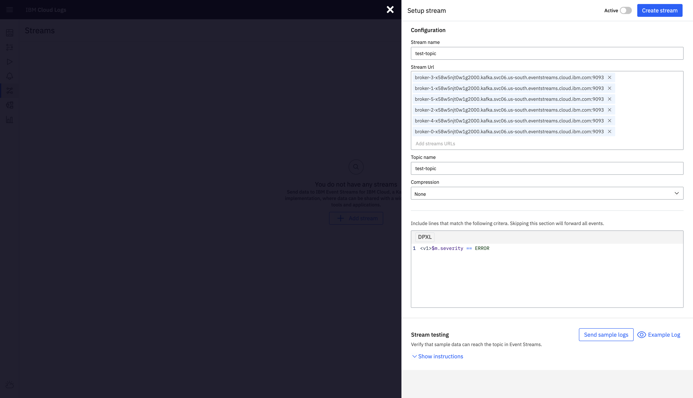

---

copyright:
  years:  2024
lastupdated: "2024-08-26"

keywords:

subcollection: cloud-logs

---

{{site.data.keyword.attribute-definition-list}}

# Integrating {{site.data.keyword.logs_full_notm}} with {{site.data.keyword.messagehub}}
{: #streaming-config}

You can use {{site.data.keyword.messagehub_full}} with {{site.data.keyword.logs_full_notm}} to stream and manage log data. {{site.data.keyword.messagehub_full}} is a scalable, managed Apache Kafka service that lets applications send data by creating messages and sending them to a topic. Applications can subscribe to these topics to receive messages, enabling real-time data processing and analytics.
{: shortdesc}

When you update the streaming configuration after it is enabled, the changes are picked automatically. It takes a few minutes for the changes to be applied.
{: note}

## Prereqs
{: #streaming-config-prereqs}

- An {{site.data.keyword.messagehub_full}} instance is provisioned in the same account as the {{site.data.keyword.logs_full_notm}} instance from where you plan to stream data.

    Check the limitations of the service plans. For more information, see [Limits and quotas](/docs/EventStreams?topic=EventStreams-kafka_quotas).{: important}

- You have permissions to create a topic in the {{site.data.keyword.messagehub_full}} instance.

    To create a topic in {{site.data.keyword.messagehub}}, you must have the **manager** role for the {{site.data.keyword.messagehub}} instance. This role includes the **messagehub.topic.manage** IAM action role that allows an app or user to create or delete topics.

- You have permissions to configure streaming in your {{site.data.keyword.logs_full}} instance.

    You must have the **manager** service role.

## Create the service to service authorization
{: #streaming-config-1}
{: step}

Authorization permissions to send data from an {{site.data.keyword.logs_full}} instance to a topic that is defined in an {{site.data.keyword.messagehub}} instance is done by configuring a service to service authorization in IAM in {{site.data.keyword.cloud_notm}}.

To configure the service to service authorization, see [Creating a S2S authorization to work with the {{site.data.keyword.messagehub}} service](/docs/cloud-logs?topic=cloud-logs-iam-service-auth-es).

## Create a topic
{: #streaming-config-2}
{: step}

In your {{site.data.keyword.messagehub_full}} instance, you must define a topic where the {{site.data.keyword.logs_full_notm}} instance stream data.

Complete the following steps to create an {{site.data.keyword.messagehub}} topic:

1. Click the **Menu** icon  &gt; **Resource list**.

2. Look for the {{site.data.keyword.messagehub}} instance that you plan to use, and select it.

3. In the {{site.data.keyword.messagehub}} instance console, click **Topics**.

4. Click **Create topic**.

5. Enter a topic name and click **Next**.

6. Enter the number of partitions and click **Next**.

    One or more partitions make up a topic. A partition is an ordered list of messages. Partitions are distributed across the brokers in order to increase the scalability of your topic. You can also use them to distribute messages across the members of a consumer group.
    {: note}

7. Select a **Message retention**.

    **Message retention** defines how long messages are retained before they are deleted. If your messages are not read by a consumer within this time, they will be missed.
    {: important}

8. Click **Create Topic**.

## Configure streaming
{: #streaming-config-3}
{: step}

Configure your {{site.data.keyword.logs_full_notm}} instance to stream data to a topic in your {{site.data.keyword.messagehub_full}} instance.

Complete the following steps:

1. [Log in to your {{site.data.keyword.cloud_notm}} account](https://cloud.ibm.com/login){: external}.

2. [Access your {{site.data.keyword.logs_full_notm}} instance](/docs/cloud-logs?topic=cloud-logs-instance-launch#instance-launch-cloud-ui)

3. Click the **Data pipeline icon**  > **Streams**.

4. Click **+ Add stream**.

5. Configure the stream:

   * For **Stream name**, enter a name of your choice.

   * For **Stream Url**,  enter the _Bootstrap server_ list. Complete the following steps to get the list:

        Click the **Menu** icon  &gt; **Resource list**.

        Look for the {{site.data.keyword.messagehub}} instance that you plan to use, and select it.

        Select **Topics**. Then, click **Connect to this topic**

        In the **Resources** section make a copy of the provided _Bootstrap server_ list.

        [connect-to-service-page](images/es-connect-page.png){: caption="Connect dialog" caption-side="bottom"}

   * For **Topic name**, enter the name of your {{site.data.keyword.messagehub_full}} topic.

   * To limit the data that will be sent to the topic, enter a query that matches the logs you want sent. For example, `$m.severity == ERROR`

       For more information on how to define data rules, see [Configuring streaming data rules](/docs/cloud-logs?topic=cloud-logs-streaming_rules).

The following image shows a sample configuration:

{: caption="Example stream configuration" caption-side="bottom"}

## Validate the configuration
{: #streaming-config-4}
{: step}

Validate that you can stream a sample test log line to the topic before starting streaming.

Complete the following steps:

1. Use a Kafka tool to connect securely to the {{site.data.keyword.messagehub_full}} instance. For example, you can use [Use Kafka Connect or ksqlDB](/docs/EventStreams?topic=EventStreams-quick_setup_guide&interface=ui#kafka_connect_ksql).

2. Send a sample log to verify the connection.

    Click **Send sample log** to test the connection. You should see the sample message in your console within a minute.

## Start streaming
 {: #streaming-config-activate}
 {: step}

After you verify that the sample log is successfully received, set the streaming configuration to active and click **Create stream**.

It takes a few minutes before a streaming configuration starts streaming once you enable the configuration.

Your {{site.data.keyword.messagehub_full}} will now filter and receive messages according to the specified query.
