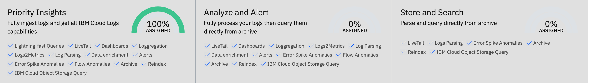

---

copyright:
  years:  2024
lastupdated: "2024-07-09"

keywords:

subcollection: cloud-logs

---

{{site.data.keyword.attribute-definition-list}}

# Data pipelines
{: #tco-data-pipelines}

In {{site.data.keyword.logs_full}}, you can define the way logs are distributed across different data pipelines and balance cost in your environment.
{: shortdesc}

## About data pipelines
{: #tco-data-pipelines-about}

There are 3 data pipelines. Each pipeline has a different storage price.

- {{site.data.keyword.frequent-search}} pipeline
- {{site.data.keyword.monitoring}} pipeline
- {{site.data.keyword.compliance}} pipeline

Each pipeline offers different features that you can use to work with the data.

| Feature                    | {{site.data.keyword.frequent-search}} | {{site.data.keyword.monitoring}}      | {{site.data.keyword.compliance}}      |
|----------------------------|----------------------------|----------------------------|----------------------------|
| Fast query              | [Yes]{: tag-green} | [No]{: tag-red} | [No]{: tag-red} |
| High-speed search using hot storage              | [Yes]{: tag-green} | [No]{: tag-red} | [No]{: tag-red} |
| Dashboards and analytics using hot storage              | [Yes]{: tag-green} | [No]{: tag-red} | [No]{: tag-red} |
| Dashboards and analytics using {{site.data.keyword.cos_full_notm}}              | [Yes]{: tag-green} | [Yes]{: tag-green} | [No]{: tag-red} |
| Intelligent log analytics           | [Yes]{: tag-green} | [Yes]{: tag-green} | [No]{: tag-red} |
| Alert on logs           | [Yes]{: tag-green} | [Yes]{: tag-green} | [No]{: tag-red} |
| Metrics maintained on log data for up to 1 year        | [Yes]{: tag-green} | [Yes]{: tag-green} | [No]{: tag-red} |
| Re-index logs for further analysis        | [Yes]{: tag-green} | [Yes]{: tag-green} | [Yes]{: tag-green} |
| Search logs in {{site.data.keyword.cos_full_notm}}        | [Yes]{: tag-green} | [Yes]{: tag-green} | [Yes]{: tag-green} |
| Store logs in {{site.data.keyword.cos_full_notm}}        | [Yes]{: tag-green} | [Yes]{: tag-green} | [Yes]{: tag-green} |
{: caption="Table 1. Features available in each data pipeline" caption-side="top"}

### Using the {{site.data.keyword.tco-optimizer}}
{: #about-tco-use}

You use the {{site.data.keyword.tco-optimizer}} to configure policies that define which data pipeline handles data after ingestion.

You can apply policies to data based on the application name, the subsystem name, and log severity. These 3 fields are metadata fields that all log data must have. For more information, see [Metadata fields](/docs/cloud-logs?topic=cloud-logs-metadata).

The {{site.data.keyword.tco-optimizer}} can help you improve real-time analysis and alerting while managing costs. {: tip}

You can exclude data by defining a TCO policy that is applied immediately after ingestion or by configuring a *Block parsing rule*. Data excluded by using the TCO policy is dropped. Data excluded by using a Block parsing rule offers 2 options: drop the data or allow the data to be available through live tail. When you configure the option to view data in live tail, data is also archived to the service instance's COS bucket.

When you configure parsing rules that add metadata, drop data, or replace data in a log record, or when you enrich log data, the log line that is archived is the log line modified.

{: caption="Figure 1. Available data pipelines." caption-side="bottom"}

The following table outlines core features by data pipeline for data ingested after TCO policies are applied:

| Feature                    | {{site.data.keyword.frequent-search}} | {{site.data.keyword.monitoring}}      | {{site.data.keyword.compliance}}      |
|----------------------------|----------------------------|----------------------------|----------------------------|
| Parsing rules              | [Yes]{: tag-green} | [Yes]{: tag-green} | [Yes]{: tag-green} |
| Custom data enrichment     | [Yes]{: tag-green} | [Yes]{: tag-green} | [Yes]{: tag-green} |
| Schema store               | [Yes]{: tag-green} | [Yes]{: tag-green} | [Yes]{: tag-green} |
| Events to Metrics             | [Yes]{: tag-green} | [Yes]{: tag-green} | [No]{: tag-red} |
| Dynamic alerting           | [Yes]{: tag-green} | [Yes]{: tag-green} | [No]{: tag-red} |
| Templating                 | [Yes]{: tag-green} | [Yes]{: tag-green} | [No]{: tag-red} |
| Anomaly detection          | [Yes]{: tag-green} | [Yes]{: tag-green} | [No]{: tag-red} |
| Indexing                   | [Yes]{: tag-green} | [No]{: tag-red} | [No]{: tag-red} |
{: caption="Table 2. Core features by data pipeline for data ingested after TCO policies are applied" caption-side="top"}

### {{site.data.keyword.cos_full_notm}} requirement
{: #about-cos-use}

You must have a {{site.data.keyword.cos_full_notm}} bucket configured for your instance to archive data for long term storage from the {{site.data.keyword.frequent-search}} data pipeline, to archive data for the {{site.data.keyword.monitoring}} and {{site.data.keyword.compliance}} data pipelines, and if you configure parsing rules that block data with the option to see data through live tail.

## {{site.data.keyword.frequent-search}} data pipeline
{: #tco-optimizer-high}

Use the *{{site.data.keyword.frequent-search}} data pipeline* for high priority logs that require the most immediate attention and intervention such as logs for troubleshooting problems or analyzing unexpected behaviour.
{: tip}

Features available for high prioirty logs are:

* Serverless monitoring

* Rapid query

* [Custom dashboards](/docs/cloud-logs?topic=cloud-logs-create_dashboards)

* Service Catalog

* Service Map

* Alerting

* Events to Metrics

* Query archive

* Viewing traces in your explore screen

## {{site.data.keyword.monitoring}} data pipeline
{: #tco-optimizer-medium}

Use the *{{site.data.keyword.monitoring}} data pipeline* for medium priority logs that may require attention at some point, but do not require immediate attention.
{: tip}

Features available for medium priority logs are:

- Service Catalog

- Service Map

- Alerting

- Events to Metrics

- Query archive

- Viewing traces in your explore screen

## {{site.data.keyword.compliance}} data pipeline
{: #tco-optimizer-low}

Use the *{{site.data.keyword.compliance}} data pipeline* for logs that you must keep for compliance purposes but do not require action to be taken.
{: tip}

Features available for low priority logs include:

- Query archive

- Viewing traces in your explore screen
