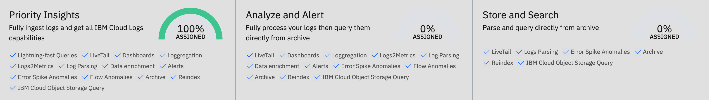

---

copyright:
  years:  2024, 2026
lastupdated: "2026-04-05"

keywords:

subcollection: cloud-logs

---

{{site.data.keyword.attribute-definition-list}}

# Configuring the {{site.data.keyword.tco-optimizer}}
{: #tco-optimizer}

In {{site.data.keyword.logs_full}}, you can configure the Total Cost of Ownership ({{site.data.keyword.tco-optimizer}}) and define policies that specify how to route logs to different data pipelines based on their business value. Each pipeline has a different storage price and offers different features. By defining the data pipeline based on the importance of the data to your business, the {{site.data.keyword.tco-optimizer}} can help you improve real-time analysis and alerting and helps you manage costs. In addition, if you enable archive retention tags in your {{site.data.keyword.logs_full_notm}} instance, you can also configure different data retention periods per policy.
{: shortdesc}

By default, when you send data to an {{site.data.keyword.logs_full_notm}} instance, data is routed to the {{site.data.keyword.frequent-search}} data pipeline at ingestion. This data is retained and available for search by the {{site.data.keyword.logs_full}} service for the number of days that you specify at the instance level. You can configure 7 days, 14 days, 30 days or 90 days.

The {{site.data.keyword.tco-optimizer}} includes the following data pipelines:

{{site.data.keyword.frequent-search}}
:   Logs that require immediate access and full {{site.data.keyword.logs_full_notm}} analysis capabilities. These logs are typically high-severity or business-critical logs that need to be analyzed or queried individually.

{{site.data.keyword.monitoring}}
:   Logs that require processing and can be queried later if needed from an archive. These logs are typically logs used for monitoring, troubleshooting, and statistical analysis.

{{site.data.keyword.compliance}}
:   Logs that need to be kept for compliance or post-processing reasons but can be maintained and queried from an archive.

Blocked
:   Logs that are discarded and are not available for search.

When you provision an {{site.data.keyword.logs_full_notm}} instance without an {{site.data.keyword.cos_full_notm}} bucket, data can only be routed to the {{site.data.keyword.frequent-search}} pipeline or blocked.
{: note}

When you provision an {{site.data.keyword.logs_full_notm}} instance with an {{site.data.keyword.cos_full_notm}} bucket, data routed to the {{site.data.keyword.frequent-search}} pipeline, the {{site.data.keyword.monitoring}} pipeline, and the {{site.data.keyword.compliance}} pipeline is stored in the [{{site.data.keyword.cos_full_notm}} data bucket](/docs/cloud-logs?topic=cloud-logs-configure-data-bucket).

To configure the {{site.data.keyword.tco-optimizer}} and use different data pipelines, you must have an {{site.data.keyword.cos_full_notm}} bucket attached to your {{site.data.keyword.logs_full_notm}} instance. If you do not have the data bucket attached to the instance and you configure policies that send data to the {{site.data.keyword.monitoring}} or the {{site.data.keyword.compliance}} data pipelines, the data is not available for search or alerting as it cannot be archived in the bucket.
{: attention}

Data that you send to the {{site.data.keyword.compliance}} pipeline by configuring a block parsing rule with the option to see data through live tail and search also stores data in the data bucket. However, notice that a block parsing rule is applied after the {{site.data.keyword.tco-optimizer}} policies are applied. Archive retention tags cannot be used with the data sent to {{site.data.keyword.compliance}} through a blick parsing rule.
{: important}

When you configure TCO policies, each policy is assigned a priority. The selected priority determines the TCO data pipeline for the logs that match the criteria.

| Priority value | TCO pipeline |
| -------------- | -------------- |
| `High` | {{site.data.keyword.frequent-search}} |
| `Medium` | {{site.data.keyword.monitoring}} |
| `Low` | {{site.data.keyword.compliance}} |
| `Blocked` | `[*]` |
{: caption="Mapping of policy priority to TCO pipeline" caption-side="bottom"}
{: #tco_mapping}

`[*]` Logs matching policies with the `Blocked` priority are dropped and are not sent to any TCO pipeline.

You can apply policies to data based on the application name, the subsystem name, and log severity. These 3 fields are metadata fields that all log data must have. For more information, see [Metadata fields](/docs/cloud-logs?topic=cloud-logs-metadata).
{: note}

{: caption="Available data pipelines." caption-side="bottom"}

Each pipeline offers different features:

| Feature                    | {{site.data.keyword.frequent-search}} | {{site.data.keyword.monitoring}}      | {{site.data.keyword.compliance}}      |
|----------------------------|----------------------------|----------------------------|----------------------------|
| High-speed search               | [Yes]{: tag-green} | [No]{: tag-red} | [No]{: tag-red} |
| Dashboards and analytics using hot storage              | [Yes]{: tag-green} | [No]{: tag-red} | [No]{: tag-red} |
| Dashboards and analytics using {{site.data.keyword.cos_full_notm}}              | [Yes]{: tag-green} | [Yes]{: tag-green} | [No]{: tag-red} |
| Intelligent log analytics           | [Yes]{: tag-green} | [Yes]{: tag-green} | [No]{: tag-red} |
| Alert on logs           | [Yes]{: tag-green} | [Yes]{: tag-green} | [No]{: tag-red} |
| Metrics maintained on log data for up to 1 year        | [Yes]{: tag-green} | [Yes]{: tag-green} | [No]{: tag-red} |
| Re-index logs for further analysis        | [Yes]{: tag-green} | [Yes]{: tag-green} | [Yes]{: tag-green} |
| Search logs in {{site.data.keyword.cos_full_notm}}        | [Yes]{: tag-green} | [Yes]{: tag-green} | [Yes]{: tag-green} |
| Store logs in {{site.data.keyword.cos_full_notm}}        | [Yes]{: tag-green} | [Yes]{: tag-green} | [Yes]{: tag-green} |
| Parsing rules              | [Yes]{: tag-green} | [Yes]{: tag-green} | [Yes]{: tag-green} |
| Custom data enrichment     | [Yes]{: tag-green} | [Yes]{: tag-green} | [Yes]{: tag-green} |
| Schema store               | [Yes]{: tag-green} | [Yes]{: tag-green} | [Yes]{: tag-green} |
| Dynamic alerting           | [Yes]{: tag-green} | [Yes]{: tag-green} | [No]{: tag-red} |
| Templating                 | [Yes]{: tag-green} | [Yes]{: tag-green} | [No]{: tag-red} |
| Anomaly detection          | [Yes]{: tag-green} | [Yes]{: tag-green} | [No]{: tag-red} |
{: caption="Features available in each data pipeline" caption-side="top"}

Policies are evaluated in order, top down by default. The first matching policy is applied, and no other policies are evaluated.
{: attention}

- If policies conflict, the first policy that is listed on the {{site.data.keyword.tco-optimizer}} page takes precedence.
- Policies are processed in the order configured and displayed on the UI. The first policy that is matched is the policy that is applied. Remaining policies are ignored.
- Policies that block data should be defined last.

### {{site.data.keyword.frequent-search}} data pipeline
{: #tco-optimizer-high}

Use the *{{site.data.keyword.frequent-search}} data pipeline* for high priority logs that require the most immediate attention and intervention such as logs for troubleshooting problems or analyzing unexpected behaviour.
{: tip}

Features available for high prioirty logs are:

* Serverless monitoring

* Rapid query

* [Custom dashboards](/docs/cloud-logs?topic=cloud-logs-create_dashboards)

* Service Catalog

* Service Map

* Alerting

* Events to Metrics

* Query archive

* Viewing traces in your explore screen

### {{site.data.keyword.monitoring}} data pipeline
{: #tco-optimizer-medium}

Use the *{{site.data.keyword.monitoring}} data pipeline* for medium priority logs that may require attention at some point, but do not require immediate attention.
{: tip}

Features available for medium priority logs are:

- Service Catalog

- Service Map

- Alerting

- Events to Metrics

- Query archive

- Viewing traces in your explore screen

### {{site.data.keyword.compliance}} data pipeline
{: #tco-optimizer-low}

Use the *{{site.data.keyword.compliance}} data pipeline* for logs that you must keep for compliance purposes but do not require action to be taken.
{: tip}

Features available for low priority logs include:

- Query archive

- Viewing traces in your explore screen

## Accessing the {{site.data.keyword.tco-optimizer}}
{: #tco-access}

Complete the following steps to access the {{site.data.keyword.tco-optimizer}}:

1. [Launch the {{site.data.keyword.logs_full_notm}} UI.](/docs/cloud-logs?topic=cloud-logs-instance-launch#instance-launch-cloud-ui)

2. Click the **Data pipeline** icon  > **TCO Optimizer**.

The {{site.data.keyword.tco-optimizer}} page shows the percentage of ingested data that is flowing to each pipeline after the configured policies are applied.

## Creating a policy
{: #tco-optimizer-create-policy}

You must have a [{{site.data.keyword.cos_full_notm}} data bucket](/docs/cloud-logs?topic=cloud-logs-configure-data-bucket) configured before creating a policy.
{: attention}

On the {{site.data.keyword.tco-optimizer}} page, complete the following steps to create a new policy:

1. Click **Create policy**.

2. In the *Details* section, complete the following tasks:

    Enter a policy name.

    Enter a description. The description is optional.

    Define the policy order. This order determines which rule is applied when multiple policies match. By default, the first policy has the highest priority.

3. In the *Filters* section, add 1 or more filters to configure the applications, subsystems, and severity values that are relevant for this policy.

   Logs received by {{site.data.keyword.logs_full_notm}} without a severity are treated as if their severity is `debug`.
   {: note}

   Create a parsing rule to set the priority of logs at ingestion when a priority value is not included.
   {: tip}

   For applications and subsystems, criteria can be specified when the value matches one of: `All`, `Is`, `Is Not`, `Includes`, or `Starts With`.

4. In the *Policy Type* section, select **Standard** to route all matching data to the priority that you configure in the next step.

5. In the *Priority* section, set the priority for the policy. The priority determines the [pipeline](#tco_mapping) for logs that are matched by the policy.

    Valid values are: `High` for data managed through {{site.data.keyword.frequent-search}}, `Medium` for data managed through {{site.data.keyword.monitoring}}, `Low` for data managed through {{site.data.keyword.compliance}} and `Block` for data that you drop and is not available for search.

    The default value is `High`.

6. In the *Archive retention* section, choose a [retention tag](/docs/cloud-logs?topic=cloud-logs-retention-tags).

    By default, the **Default** tag is selected.

    Notice that retention tags are available if they are defined and activated.

5. Click **Apply**.

## Modifying a policy
{: #tco-optimizer-modify-policy}

On the {{site.data.keyword.tco-optimizer}} page, complete the following steps to modify an existing policy:

1. Click the policy that you want to change.

2. Modify the criteria.

3. Click **Apply**.

If you want to change the policy priority value, you can also change the priority in the **Priority** drop-down list for the policy in the policy list. The priority determines the [pipeline](#tco_mapping) for logs that are matched by the policy.
{: tip}

## Deleting a policy
{: #tco-optimizer-delete-policy}

On the {{site.data.keyword.tco-optimizer}} page, complete the following steps to delete an existing policy:

1. Click the policy that you want to delete.

2. Click **Delete**.

3. Confirm that you want to delete the policy.

## Creating an application and policy override
{: #tco-optimizer-override}

Configuring application and policy overrides is only available through the UI.
{: note}

The **Application and policy overrides** section displays the usage of all applications and subsystems producing logs, sorted by the top producers. You can use the filters to easily search and filter the list.

By clicking a row, you will see a detailed view of the application-subsystem pair usage organized by severity level and the TCO pipeline priority assigned.

In this view, you are able to change the priority for an entire application-subsystem pair, or change the priority for specific log severities within any application-subsystem pair. The priority will determine the TCO data pipeline where the data for the pair will be sent. If there are different priorities for different severities, the policy status displayed in the **Application and policy overrides**  table will be *Multiple*.

To override the priority for a speciic application-subsystem pair, do the following:

1. In **Application and policy overrides** click the application-subsystem pair you want to modify.

2. Update the priority as needed.

   * To update the priority used for the entire application-sybsystem pair, change **Set priority to** to the preferred priority.

   * To update the priority based on the log severity, in **Tune severity** change the priority for the specific severity to the preferred priority.

3. Click **Apply** to save the changes.

If you want to reset all overrides for all application-subsystem pairs to the default behavior, click **Reset All Overrides**. Be aware this will reset all overrides.
{: attention}
